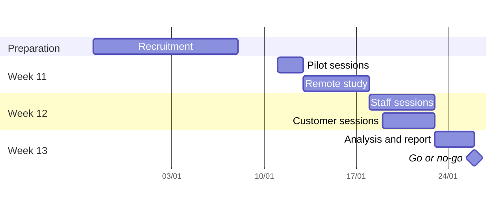

# Introduction

## Purpose

This plan sets out how TASCO Insurance and iorta TechNXT will test the usability of the TASCO Growth Platform with real users before go-live. It covers the objectives, the participants and how they are recruited in Vietnam, the tasks for each persona with their success criteria and target times, the methods, the measures, the schedule inside the UAT window, the severity scale, reporting, and ethics and consent.

## Scope

The minimum viable product as delivered for user acceptance testing: the customer app in the VETC app and on the TASCO website, and the staff console for telesales, product and compliance staff. Other staff roles are covered by the UAT scenarios in TGP-QA-04 and by short observation where time allows. Testing uses the hosted UAT environment with synthetic data only.

## Audience

The TASCO product owner, who owns the usability exit criterion; TASCO compliance, who approves the consent arrangements; the VETC product owner and TASCO marketing, who help recruit customers; the iorta TechNXT UX lead and QA lead, who run the study.

## Related documents

| ID | Title |
|---|---|
| TGP-BUS-03 | Non-Functional Requirements |
| TGP-BUS-06 | Personas and Customer Journeys |
| TGP-UX-02 | UX Standards and Accessibility |
| TGP-UX-03 | Information Architecture and Navigation |
| TGP-QA-04 | User Acceptance Test Plan |
| TGP-DEL-01 | Project Plan |

# Objectives

For the go or no-go decision, the study shows whether the people who will use the platform at launch can complete their main tasks unaided, quickly and with confidence.

| No. | Objective | Measured by |
|---|---|---|
| O-1 | Drivers renew TNDS from a reminder without help and trust what they see | Task success, taps, time on task, trust rating |
| O-2 | Drivers pay a quote sent by a telesales advisor inside the app | Task success, time on task |
| O-3 | Telesales agents go from a hot handoff to a quote sent to the customer's app without taking payment | Task success, time on task, critical errors |
| O-4 | Product staff change a business rule and submit it, and compliance staff review and approve it, without IT help | Task success, time on task, SEQ |
| O-5 | Nobody believes the TNDS premium is discounted | Comprehension answer |
| O-6 | The UAT exit criterion X4 is met: task success of 90 % or more on UAT-TS-01, UAT-TS-02 and UAT-CU-01, and SUS of 70 or more | Task success, SUS |

The study also settles one open design question. The renewal path takes six taps today against a target of three (NFR-035; see TGP-UX-03). The sessions record where customers hesitate in the declaration and confirmation steps, so that the product owner and compliance can decide whether to shorten the flow.

# Participants

## Who takes part

All participants live and work in Vietnam. Customers are recruited in Hà Nội and TP. Hồ Chí Minh, the two pilot regions, with a mix of ages, Android and iOS phones, and TASCO and non-TASCO policyholders. Five to eight participants per group find most usability problems; customer groups have at least eight, as NFR-035 requires.

| Group | Persona (TGP-BUS-06) | Moderated | Remote unmoderated | Criteria |
|---|---|---|---|---|
| Drivers in the VETC app | PC-1, PC-2, PC-4 | 10 (5 per city) | 40 | Use the VETC app at least monthly; own a car; TNDS due within 90 days or lapsed up to 60 days; at least 3 aged 55 or over |
| TASCO website users | PC-1, PC-3 | 8 (4 per city) | 20 | Visited baohiemtasco.vn or bought on e.baohiemtasco.vn in the past year |
| Telesales agents | PS-01 | 8 | | Mix of tenure under 6 months and over 2 years; Hà Nội and TP. Hồ Chí Minh teams |
| Telesales supervisors | PS-02 | 2 | | One per city |
| Product staff (rule authors) | PS-04 | 4 | | TASCO product team members who will own scoring, journeys and wording |
| Compliance staff (approvers) | PS-05 | 3 | | TASCO compliance officers who will approve changes |
| Accessibility participants | PC-1 | 3 | | One screen-reader user, one person with low vision, one driver aged 65 or over |

Fleet managers (PC-5) are out of scope because the fleet portal is in the scale phase. Claims handlers, data stewards, campaign managers and partner managers are observed during their UAT scenarios rather than in separate sessions.

## Recruitment

| Group | Channel | Screening | Incentive |
|---|---|---|---|
| Drivers in the VETC app | VETC in-app invitation sent only to users who have agreed to be contacted for research; intercepts at VETC service points | Short screener in Vietnamese: car ownership, TNDS expiry month, phone type, age band | Non-cash voucher, not linked to any premium |
| TASCO website users | TASCO marketing contact list of customers who agreed to research contact | Same screener plus last visit to the website | Same voucher |
| Staff groups | Named by the TASCO Sales, Product and Compliance leads | Must not have built or tested the screens | Session in working time |
| Accessibility participants | Disability associations in Hà Nội and TP. Hồ Chí Minh; the VETC research panel | Assistive technology used, phone type | Voucher and travel costs |

The voucher must not be framed as, or exchangeable for, a discount on insurance. Recruitment starts in week 9 so that participants are confirmed before the UAT window opens.

# Tasks

Each task is read aloud in Vietnamese as a short scenario. Target times are for a first-time user, measured from the end of the scenario to the success state, and exclude phone calls and typing of personal details. Taps count deliberate taps or clicks, as in TGP-UX-03.

## Drivers in the VETC app

| No. | Scenario | Success criteria | Target |
|---|---|---|---|
| C-1 | "Bạn vừa nhận thông báo từ VETC rằng bảo hiểm TNDS xe của bạn sắp hết hạn. Hãy gia hạn." | E-certificate shown after payment | 90 % success; 90 s or less; taps recorded (6 today) |
| C-2 | "Tư vấn viên TASCO vừa gửi báo giá cho bạn. Hãy xem và thanh toán." | Finds the quote on Home and pays it | 90 % success; 60 s or less |
| C-3 | "Ứng dụng hỏi ngày hết hạn bảo hiểm hiện tại. Ngày đúng là 20/11/2026. Hãy cập nhật." | Correct date and insurer saved | 90 % success; 45 s or less |
| C-4 | "Bạn muốn bảo vệ thêm cho người ngồi trên xe. Hãy xem phí và thêm vào." | Seat accident cover in the paid order | 80 % success; 90 s or less |
| C-5 | "Cảnh sát giao thông muốn kiểm tra bảo hiểm của bạn. Hãy cho họ xem." | QR shown full screen; the check page says the certificate is valid | 90 % success; 20 s or less |
| C-6 | "Bạn vừa bị va chạm nhẹ. Hãy báo tai nạn." | Claim sent; participant can say when TASCO will respond | 85 % success; 4 min or less |
| C-7 | "Bạn không muốn nhận cuộc gọi tư vấn nữa." | Call consent switched off and confirmed | 90 % success; 30 s or less |
| C-8 | "Bạn cần gọi cho TASCO. Số nào?" | Finds 1900 1562 through the support button or Account | 90 % success; 20 s or less |
| C-9 | "Mua qua ứng dụng VETC có rẻ hơn không? Bạn được gì?" | Says the price is the same everywhere and names one benefit | 80 % |

Remote unmoderated participants do C-1, C-2, C-5, C-7 and C-9 on their own phones, followed by the SUS.

## TASCO website users

| No. | Scenario | Success criteria | Target |
|---|---|---|---|
| W-1 | "Bạn vào website Bảo hiểm TASCO để mua bảo hiểm TNDS cho xe. Hãy mua cho 1 năm." | Completes payment through the TASCO payment gateway sandbox | 90 % success; 2 min or less |
| W-2 | "Xe của bạn có kinh doanh vận tải không, và có bao nhiêu chỗ? Hãy kiểm tra thông tin xe trước khi trả tiền." | Answers the vehicle questions correctly and confirms the vehicle card | 90 % success |
| W-3 | "Trang này có phải của Bảo hiểm TASCO không? Vì sao bạn nghĩ vậy?" | Names the brand cues (logo, colours, hotline) | Qualitative |

## Telesales agents and supervisors

| No. | Scenario | Success criteria | Target |
|---|---|---|---|
| A-1 | Sign in and find the most urgent customer waiting for a call | Opens the oldest new hot handoff | 90 % success; 30 s or less |
| A-2 | Before calling, tell us what the customer cares about | Names the trust or price signal and two talking points | 90 % success |
| A-3 | The customer wants TNDS and accident cover for seven seats. Prepare the quote and send it to the customer's app | Correct quote sent; no payment details asked for | 90 % success; 2 min or less; no critical error |
| A-4 | The customer asks for a discount. Show how the screen helps you answer | Uses the regulated-price line and offers a service benefit | 90 % success |
| A-5 | The customer will decide tomorrow at 10:00. Record that | Callback scheduled with date and time | 95 % success; 45 s or less |
| S-1 | (Supervisor) An agent is absent. Move one of her handoffs to a colleague | Handoff reassigned with a note | 90 % success; 60 s or less |

A-1 to A-3 together cover UAT-TS-01 and UAT-TS-02.

## Product staff

| No. | Scenario | Success criteria | Target |
|---|---|---|---|
| P-1 | Lower the hot-lead threshold from 70 to 68, check the effect on a customer and on the sample, and submit it for approval | Draft validated, simulated and submitted with a note | 85 % success; 8 min or less |
| P-2 | A message you submitted last week was rejected. Find out why and what to change | Reads the rejection reason | 90 % success; 2 min or less |
| P-3 | Add the word "giảm giá" to a reminder and explain what happens | Sees the copy-guard error and explains it | 90 % success |

## Compliance staff

| No. | Scenario | Success criteria | Target |
|---|---|---|---|
| R-1 | Review the waiting contact-policy change and approve it if it is acceptable | Reads what changes and approves with a comment | 85 % success; 5 min or less |
| R-2 | Reject a change and tell the author what must change | Rejection reason given | 90 % success; 3 min or less |
| R-3 | Find who approved the last lead-scoring change and when | Correct name and date from the audit trail | 85 % success; 2 min or less |

# Method

## Moderated sessions

Moderated sessions last 45 to 60 minutes and are run in Vietnamese by a native-speaking UX researcher, with a note-taker. Customers use a test phone with the customer app opened through a signed link for their test vehicle, or their own phone if they prefer; staff use their usual office laptop and headset at 1,280 or 1,440 px.

| Part | Minutes | Content |
|---|---|---|
| Welcome and consent | 5 | Purpose, recording, the right to stop; "we are testing the product, not you" |
| Background | 5 | Renewal habits and app use (customers); current tools and pain points (staff) |
| Tasks | 30 to 40 | Think-aloud; SEQ after each task; the moderator does not help unless the participant is stuck for two minutes, which counts as a failure |
| Questionnaire | 5 | SUS in Vietnamese; trust rating from 1 to 5 (customers) |
| Debrief | 5 | What was confusing; what they would tell a friend or colleague |

Customer sessions take place in meeting rooms at TASCO or VETC offices in Hà Nội and TP. Hồ Chí Minh; staff sessions on the call-centre floor or in the office. Observers from TASCO, VETC and iorta TechNXT watch from a separate room or online and do not interrupt.

## Remote unmoderated study

The remote study reaches more drivers than the sessions can. Participants receive a link on their phone that opens the customer app in the UAT environment with a synthetic vehicle and a short task list in Vietnamese. The testing tool records task completion, time, taps and the screen (not the camera or microphone), asks the SEQ after each task and the SUS at the end. It runs for five days. Results with incomplete tasks are kept and counted as failures; results completed in under a third of the median time are excluded as not genuine.

## Accessibility sessions

The three accessibility participants do C-1, C-5 and C-7 with their own assistive technology (VoiceOver or TalkBack in Vietnamese, screen magnification, larger text). Their results are reported separately and their findings feed the accessibility gaps in TGP-UX-02.

# Measures

| Measure | How it is taken | Target |
|---|---|---|
| Task success | Completed unaided, completed with help, or failed, against the success criteria | As set per task; 90 % on C-1, C-2 and A-3 |
| Time on task | From the end of the scenario to the success state | As set per task; median reported |
| Taps or clicks | Counted from the recording | Reported against the baseline in TGP-UX-03 |
| Errors | Critical (wrong purchase, wrong customer, payment details asked for) and non-critical | No critical errors |
| SEQ | 1 to 7 after each task | Average 5.5 or more |
| SUS | Ten questions, Vietnamese version, scored 0 to 100 | 70 or more for each group; 75 or more for drivers |
| Trust rating | "Tôi tin đây đúng là dịch vụ của VETC và TASCO", 1 to 5 | Average 4.2 or more |
| Comprehension | C-9 and A-4 answers | 80 % (drivers), 95 % (agents) |

Results are given per group with the number of participants, because small groups give wide ranges. The SUS for the UAT exit criterion is the mean of all moderated and remote participants.

# Schedule

The study runs inside the test and go-live stage, weeks 11 to 13 (11 to 26 January 2027), alongside system integration testing and UAT, and reports to the go or no-go meeting on 26 January 2027.

| Dates | Activity |
|---|---|
| 28/12/2026 to 08/01/2027 (weeks 9 and 10) | Recruit and confirm participants; consent forms approved; test vehicles and signed links prepared; remote study set up |
| 11 and 12/01/2027 | Two pilot sessions (one customer, one agent); scripts adjusted |
| 13 to 17/01/2027 | Remote unmoderated study open |
| 18 to 22/01/2027 | Staff sessions on the UAT days for their persona; customer sessions in Hà Nội (19 and 20/01) and TP. Hồ Chí Minh (21 and 22/01) |
| 23 to 25/01/2027 | Analysis; findings agreed with the product owner; S1 and S2 fixes go to UAT triage |
| 26/01/2027 | Usability results in the UAT report for the go or no-go meeting |

After launch, the SUS survey is repeated with pilot users in week 2 of hypercare and the results go to the pilot read-out.

# Severity scale

Each finding gets one severity, decided by the UX lead and the product owner together. The mapping to UAT defect severities follows TGP-QA-04.

| Severity | Definition | Action | UAT severity |
|---|---|---|---|
| S1 Critical | Stops the task, or leads to a wrong payment, a wrong customer or a privacy breach | Fix before go-live; blocks the go decision | Sev 1 |
| S2 Major | Most participants are delayed or need help; some fail | Fix before go-live, or waive in writing with a date | Sev 2 |
| S3 Minor | Hesitation or irritation; participants recover alone | Fix before go-live if cheap, otherwise in the first hypercare release | Sev 3 |
| S4 Suggestion | An improvement idea, not a problem | Product backlog | Sev 4 |

A finding seen with one participant is kept but marked as such; frequency and severity together set priority.

# Reporting

- Daily during week 12: a one-page summary of tasks run, success so far and any S1 or S2 finding, sent to the product owner before the 16:30 UAT triage.
- Findings log: every finding with the task, participants affected, evidence (quote, time, screenshot), severity, recommendation and owner. S1 and S2 findings are raised as defects in UAT triage with the scenario number.
- Final report on 25/01/2027: results against each objective and target, SUS per group, the renewal tap analysis with a recommendation, the top findings with fixes, and accessibility results. It is summarised in the UAT report for the go or no-go decision.
- Customer wording changes that are business-rule content (message templates, assistant scripts) go through the rules studio with compliance approval, not as code changes.

Recordings are not distributed. Reports quote participants by group and number only ("Driver 4, Hà Nội").

# Ethics and consent

The study follows the Law on Personal Data Protection 91/2025/QH15, in force since 1 January 2026, and Decree 13/2023/ND-CP. The arrangements below are conservative defaults, to be confirmed by TASCO legal.

| Topic | Arrangement |
|---|---|
| Consent | Written consent in Vietnamese before the session, covering the purpose, what is recorded, who sees it, how long it is kept and the right to withdraw. Remote participants accept the same text before starting; no recording starts without it |
| Data collected | Name, phone number and age band for scheduling; screen and voice recordings of the session. No ID card numbers, no real policy or payment data, no health data |
| Test data | The app and console show synthetic customers and vehicles only. Participants never enter their own plate, phone number or payment details |
| Payments | Wallet and gateway payments are sandbox transactions; no money moves |
| Storage | Recordings and notes are stored in Vietnam in a folder limited to the research team, kept for 90 days after the final report and then deleted, with deletion recorded |
| Withdrawal | A participant may stop at any time and ask for their recording to be deleted, without losing the incentive |
| Staff participants | Taking part is voluntary and results are never used to assess performance; managers do not observe their own team members' sessions |
| Vulnerable participants | No one under 18. Accessibility participants may bring a companion; materials are offered in large print or read aloud |
| Personal data request | Requests to see or delete a participant's data go to the TASCO data protection contact and are answered within the legal deadline |

# Roles

| Role | Organisation | Responsibility |
|---|---|---|
| Study owner | TASCO Product Owner | Approves the plan, decides severities with the UX lead, presents results at the go or no-go meeting |
| UX lead | iorta TechNXT | Plans the study, writes scripts, analyses results, writes the report |
| Moderators | iorta TechNXT UX researchers (native Vietnamese speakers) | Run the sessions in Hà Nội and TP. Hồ Chí Minh |
| Note-takers | iorta TechNXT business analysts | Record times, taps, errors and quotes |
| Recruitment | VETC Product Owner, TASCO Marketing, TASCO Sales, Product and Compliance leads | Invite and confirm participants |
| Compliance reviewer | TASCO Compliance | Approves the consent form, the incentive and the data handling |
| Environment support | iorta TechNXT QA lead | Test phones, signed links, test accounts and resets between sessions |

# Appendix

## Session checklist

| Before | During | After |
|---|---|---|
| Consent form signed or accepted | Recording started after consent | Recording saved to the restricted folder |
| Test phone charged, app link for the participant's synthetic vehicle opened | Scenario read exactly as written | Synthetic data reset for the next participant |
| Staff test account signed in, region set | Times and taps noted per task | Findings entered in the log the same day |
| Observers briefed not to interrupt | SEQ asked after each task | Incentive handed over |
