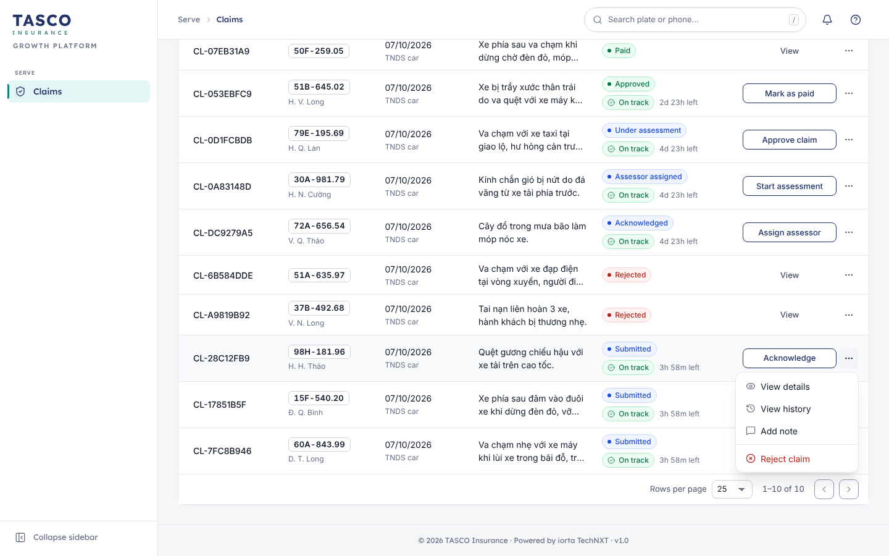

# Introduction

## Purpose

This document sets the rules every screen of the TASCO Growth Platform follows: how it is worded, how numbers and dates are formatted, how workflow actions behave, how errors are reported, how WCAG 2.2 AA is met, how the interface is localised and how it adapts to screen sizes. It ends with the review checklist used in design review and by QA, as required by the Definition of Done in TGP-DEL-02 Delivery Methodology.

## Scope

The staff console, the customer app in its four hosts and the public certificate check page. Visual tokens and components are defined in TGP-UX-01; navigation and the screen inventory in TGP-UX-03.

## Audience

Designers, front-end engineers and QA at iorta TechNXT; the TASCO product owner and compliance, who approve customer wording; TASCO IT, who inherit the standards after handover.

## Related documents

| ID | Title |
|---|---|
| TGP-UX-01 | Design System |
| TGP-UX-03 | Information Architecture and Navigation |
| TGP-BUS-03 | Non-Functional Requirements |
| TGP-QA-01 | Test Strategy |
| TGP-QA-02 | Test Case Catalogue |
| TGP-DEL-02 | Delivery Methodology |

# Writing and business language

The platform is used by insurance people, not engineers. Every word on screen is written for them.

## Rules for all screens

| Rule | Example |
|---|---|
| No internal codes, record identifiers, JSON, JSON paths, hashes or store names in business views | "Mời khách xác nhận ngày hết hạn" or "Ask customer to confirm expiry", never `verify_expiry` |
| Every code is shown through the label dictionary, in Vietnamese and English | Data source `partner_fleet` appears as "Partner fleet file" |
| Technical detail only in a collapsed "Technical details" section, and only for administrators, support engineers and auditors | The audit record hash and the IP address of a sign-in |
| Actions are verbs in sentence case | "Approve claim", "Send quote", "Resolve…" |
| A status name is never an action label | "Start assessment", not "Under assessment" |
| A record's status appears once, as a chip | The claim row shows "Approved"; the drawer shows the steps, not a second status |
| Page subtitles are one short line (90 characters or fewer) or absent | "Accident reports from the VETC app" |
| No paragraphs inside cards | Explanations go into field help, a tooltip, an empty state or the Help panel |
| Readable references stay in the normal typeface | "CL-0D1FCBDB", not in a monospace code font |
| An ellipsis on a label means the action asks for more input | "Resolve…", "Assign to…" |

Data values such as plates, names, rule names and policy numbers are never translated.

## Customer wording

Customer text is Vietnamese, warm and short. The app addresses the customer as "bạn" and uses "Quý khách" only where no name is known. Sentences stay under about 20 words, and TNDS is explained as "Bảo hiểm TNDS bắt buộc" on first use in a flow.

Two safety messages sit at the foot of the main customer screens and appear in every relevant flow:

- "Phí bảo hiểm TNDS bắt buộc theo quy định của Bộ Tài chính." The TNDS premium is set by regulation.
- "VETC và TASCO không bao giờ yêu cầu mã OTP qua điện thoại." in VETC hosts, and "TASCO không bao giờ yêu cầu mã OTP qua điện thoại." in TASCO's own hosts. Payment happens only inside the app.

## No discount wording

TNDS is price-regulated, so customer copy must never suggest a discount. The copy guard in the business rules blocks these phrases in message templates and assistant scripts: giảm giá, chiết khấu, hoàn tiền, khuyến mãi phí, rẻ hơn, discount, cashback, rebate, % off, cheaper, lower premium, price cut. Text written into the app itself is not checked by the guard, so design review checks it against the same list.

| Do not write | Write instead |
|---|---|
| "Giảm 10 % khi gia hạn qua VETC" | "Gia hạn qua VETC: cứu hộ 24/7 và giấy chứng nhận điện tử ngay" |
| "Rẻ hơn mua ngoài" | "Giá theo quy định của Bộ Tài chính" |
| "Hoàn tiền vào ví" | "Thanh toán bằng ví VETC, nhận giấy chứng nhận ngay" |

## Masked personal data

Staff without permission to see personal data see names as initials and family name ("N. V. An") and phone numbers with the middle hidden ("0912 *** 678"), with a lock icon. Masking is done by the server, so no screen can show more than the role allows. The certificate check page shows a masked plate and no personal data at all.

# Formats

The console formats follow the language chosen by the user; the customer app is always Vietnamese.

| Item | English console | Vietnamese console and customer app |
|---|---|---|
| Date | 07/10/2026 | 07/10/2026 |
| Date and time | 07/10/2026 14:30 | 07/10/2026 14:30 |
| Relative time | 2 hours ago | 2 giờ trước |
| Period | 03/11/2026 → 03/11/2027 | 03/11/2026 → 03/11/2027 |
| Whole number | 1,234 | 1.234 |
| Money | 831,600 ₫ | 831.600 ₫ |
| Compact money (dashboards) | 17.2M ₫ | 17,2 Tr ₫ |
| Percentage | 23% | 23% |
| Duration | 2d 4h | 2 ngày 4 giờ |
| Plate | 30E-949.35 | 30E-949.35 |

- Dates are always day, month, year (dd/MM/yyyy) in Vietnam time (UTC+7), in both languages. They are stored and sent as ISO dates. Relative times switch to the date after 30 days and always show the exact time in a tooltip.
- Money is in đồng with the sign "₫" after the number, separated by a non-breaking space so the sign never wraps onto a new line. Amounts are rounded to whole đồng and include VAT unless the label says otherwise ("Phí bảo hiểm (chưa VAT)").
- Business documents, including this one, write money as "VND 480,700".
- Plates are formatted by one shared function (30E-949.35, 51B-645.02, 29A-1234, 59X1-123.45) and shown as a plate tag.
- Numbers in tables are right-aligned with tabular figures.

# Workflow actions

Every list where records move through steps (claims, telesales handoffs, data issues, partners, rule changes, users and jobs) follows one pattern. It came from TASCO's review of the first claims queue, where buttons were named after target statuses and wrapped onto two lines.

## The pattern

1. The last column, "Next step", holds one primary action: a single fixed-width button, one line, labelled with a verb for what the user does next.
2. Secondary and negative actions sit in the ⋯ menu next to it ("More actions"), with negative actions in red at the bottom after a separator.
3. Closed records (paid, rejected, closed, won, lost) show a muted "View" instead of an empty cell.
4. Decisions (approve, reject, pay, assign, dismiss, suspend, export, erase, refuse) never act on one click. They open a dialog that asks for what the decision needs and then shows a summary to confirm (the decision dialog in TGP-UX-01). An irreversible decision states its consequence in a notice at the top of the dialog and asks the user to type the record's key value to confirm.
5. After the decision a toast confirms the result, the row updates in place and badge counts refresh.
6. The detail drawer shows the record's progress as workflow steps, with who did each step and when, and an SLA chip with the time left.

## Actions by workflow

| Workflow | Primary action by state | In the ⋯ menu | Decision dialog asks for |
|---|---|---|---|
| Claims | Acknowledge; Assign assessor; Start assessment; Approve claim; Mark as paid | Reject claim, Add note, View details, View history | Assessor; approved amount; payment reference; rejection reason |
| Telesales handoffs | Call customer; Send quote | Mark won, Schedule callback, Reassign (supervisors), Add note, Mark lost | Outcome note; callback date and time; agent; lost reason |
| Data quality | Resolve… | Assign to me, Assign to…, Unassign, Open Customer 360, Dismiss | Resolution with evidence; assignee; dismissal reason |
| Partners | View statement; Reactivate | View details, Issue API key, Manage API keys, Suspend | Key scopes and expiry; suspension confirmation |
| Business rules | Save draft; Submit for approval; Approve and activate; Roll back to this version | | Change note; approval comment; rejection reason |
| Users | Edit roles; Unlock; Enable | View details, Reset two-step verification, Reset password, Disable | Roles and region; confirmation |
| Operations | Run now | View history | Confirmation that the job runs on live data |
| Data requests | Export data (access); Erase personal data (erasure) | View, Open customer, Start handling, Record identity verified, Refuse | Identity check if not recorded; erasure reason and the plate typed to confirm; refusal reason and explanation for the customer |

A rule author cannot approve their own change, and the approve action is not offered to them. Restricted rule kinds (contact policy, copy guard, commission, data retention, attribute access policies) are offered only to compliance officers.

{width=16cm}

# Forms, validation and errors

## Forms

- Labels sit above fields; required fields carry a red asterisk, and optional fields say "(Optional)" when most fields are required.
- One line of help under a field gives the format or the reason ("Whole đồng, after deductible", "Ngày/tháng/năm, ví dụ 07/10/2026").
- Questions the system can answer are not asked. The plate and vehicle are filled from the session, the quote carries into payment, and a confirmed expiry date is reused.
- Inputs keep what the user typed after an error or a failed request.
- Financial and irreversible steps have a review step before the final button. The full purchase flow has a review screen and a confirmation sheet. Quick renewal has one review screen that shows the plate, vehicle, period, premium, total and payment method, with the declaration tick before "Xác nhận thanh toán". Staff decisions use the decision dialog, and erasure adds the typed plate.

## Validation

Fields are checked when the user leaves them and again on submit; typing is never blocked. On submit, focus moves to the first field in error. The message appears under the field with an icon, the field is marked invalid for screen readers, and the message is linked to the field so that it is read out.

| Situation | Message pattern | Example |
|---|---|---|
| Required field empty | What to enter | "This field is required"; "Vui lòng nhập số chỗ ngồi" |
| Wrong format | The expected format | "Invalid date (dd/mm/yyyy)"; "Ngày không hợp lệ. Nhập theo dạng ngày/tháng/năm." |
| Out of range | The allowed range | "Nhập số chỗ ngồi từ 1 đến 60"; "Giá trị xe tối thiểu 100.000.000 ₫" |
| Declaration not ticked | What to do | "Vui lòng xác nhận trước khi thanh toán." |
| All six code digits needed | What is missing | "Enter all 6 digits of the code." |

## Error messages

An error message says what happened and what to do next, never blames the user, and never shows a stack trace or a code. Staff errors carry a short reference ("Ref. 7F3C2A1B") that the service desk can find in the logs. Customer errors are always in Vietnamese and name the host app.

| Situation | Staff console | Customer app |
|---|---|---|
| Wrong username or password | "Incorrect username or password." | Not applicable |
| Account locked after five failures | "Your account is temporarily locked after several failed attempts…" | Not applicable |
| Session ended | "Session expired — please sign in again" | "Phiên làm việc đã hết hạn. Vui lòng mở lại từ ứng dụng VETC." |
| Link expired or damaged | Not applicable | "Liên kết đã hết hạn hoặc không hợp lệ. Vui lòng mở lại từ ứng dụng VETC." |
| No permission | "You do not have access to this page." | Not applicable |
| Another user changed the record | "… was modified by someone else", with Reload | Not applicable |
| Too many requests | "Too many attempts. Please wait a moment and try again." | "Bạn thao tác quá nhanh. Vui lòng thử lại sau ít phút." |
| TASCO core or the wallet unavailable | "Upstream service unavailable"; nothing was completed | "Hệ thống TASCO đang bận. Vui lòng thử lại sau ít phút." |
| Quote expired | "Quote expired — please re-quote" | "Báo giá đã hết hạn. Vui lòng xem lại phí để nhận báo giá mới." |
| Payment failed | Not applicable | "Thanh toán chưa thành công … Bạn chưa bị trừ tiền." with "Thử lại" |
| No connection | "Cannot reach the server. Check your connection and try again." | "Không có kết nối mạng. Vui lòng kiểm tra và thử lại." |

The customer app says "Bạn chưa bị trừ tiền" (you have not been charged) only after a failed payment, because orders are idempotent and a failure is refunded automatically; reconciliation flags any exception.

# Accessibility

## Commitment

The staff console, the customer app and the certificate check page conform to WCAG 2.2 Level AA (NFR-034 in TGP-BUS-03). Conformance is tested automatically and by hand as described in TGP-QA-01 Test Strategy (test cases TC-144 to TC-146), and the gaps still open on 8 October 2026 are listed in the Appendix with their fix.

## How the criteria are met

| Area | WCAG 2.2 criteria | How it is met |
|---|---|---|
| Contrast | 1.4.3, 1.4.11 | Text at 4.5:1 or more in both themes (ratios in TGP-UX-01). White text never sits on the light brand teal; buttons use action teal #0F8482 (4.52:1). The focus line is 4.52:1 against white |
| Colour alone | 1.4.1 | Every status, tier, SLA state and severity has a word and usually an icon; charts have values in the legend and a table view |
| Resize and reflow | 1.4.4, 1.4.10, 1.4.12 | Sizes in rem; the console reflows to one column and an off-canvas menu below 720 px; no fixed-height text boxes |
| Hover and focus content | 1.4.13 | Tooltips open on hover and keyboard focus, stay while hovered and close with Esc |
| Keyboard | 2.1.1, 2.1.2 | All actions reachable with Tab, Enter, Space and the arrow keys; menus, tabs, drawers, dialogs and sheets follow the ARIA patterns; drawers and dialogs hold focus until closed with Esc and return focus to the opener |
| Bypass and order | 2.4.1, 2.4.3 | A skip link is the first element on every page; after each navigation focus moves to the page title |
| Focus visible | 2.4.7, 2.4.11 | Every control has the teal focus ring; sticky bars and toasts are placed so they do not cover the focused element |
| Dragging and target size | 2.5.7, 2.5.8 | No action needs dragging; console targets are at least 32 px (24 px minimum), customer app targets 44 px, buttons 52 px |
| Language | 3.1.1, 3.1.2 | The page language follows the console setting; the customer app and certificate check are marked Vietnamese |
| Predictable | 3.2.1, 3.2.2, 3.2.6 | Nothing navigates on focus or on choosing a filter; Help is always in the same place in the top bar, and the support button in the customer app |
| Errors and prevention | 3.3.1 to 3.3.4, 3.3.7 | Errors named next to the field with a fix; review and confirm before payment and decisions (on the quick renewal path the review screen and the declaration tick come before payment); erasure needs the plate typed; no repeated entry |
| Authentication | 3.3.8 | Paste and password managers allowed; the six-box code accepts a pasted code and the phone's one-time-code autofill; the authenticator set-up offers a typed key as an alternative to the QR code; no puzzles |
| Name, role, value | 4.1.2 | Native controls first; switches, tabs, menus, the search combobox and dialogs carry ARIA roles and states; icon-only buttons have names |
| Status messages | 4.1.3 | Toasts sit in a polite live region, errors in alert regions; the payment progress and result are announced |

## Keyboard map for the staff console

| Key | Action |
|---|---|
| Tab, Shift+Tab | Move between controls |
| Enter, Space | Activate a button, open a row |
| Esc | Close a menu, popover, drawer, dialog or the search results |
| Arrow keys | Move within menus, tabs, radio groups and search results |
| Home, End | First or last item in a menu or tab list |
| / | Focus the global search when not typing in a field |

## Reduced motion and other preferences

When the system asks for reduced motion, all transition durations become zero, skeleton shimmer stops, the spinner slows and sheets appear without sliding. The colour theme follows the system unless the user chose Light or Dark in the console. The browser's own zoom and text size settings are respected.

## Customer app specifics

- Every touch target is at least 44 × 44 px; buttons and inputs are 52 px; tabs are 64 px tall.
- The app reads correctly with VoiceOver and TalkBack in Vietnamese: the plate is read as "Biển số 30E-949.35", the day ring as "Còn 26 ngày bảo hiểm", the claim progress bar as "Bước 2 trên 5".
- The QR code of the certificate has a text alternative with the certificate number.
- The floating support button never appears in the purchase flow or on the quick renewal screen, so it cannot hide the payment button.
- Portrait and landscape both work.

# Localisation

## Languages

The staff console is bilingual. It opens in Vietnamese; each user can switch to English with the EN / VI switch in the utility strip or in the user menu, and the browser remembers the choice. The customer app and the certificate check are Vietnamese only, which follows the host apps; English can be added later from the same catalogue.

## How text is managed

- All interface text is held in the string catalogue (`public/js/shared/i18n.js`) and the label dictionary, with Vietnamese and English for every key. Pages register their own strings next to the page code, and shared terms cannot be overridden by a page.
- Sentences are never built by joining fragments; plurals and numbers are handled inside each string.
- Customer messages and assistant scripts are business-rule content with Vietnamese and English versions, changed only through the rules studio with maker-checker approval.
- Product, tariff and benefit names come from the product catalogue in both languages.
- Contextual help is written in both languages.

## Vietnamese conventions

| Topic | Convention |
|---|---|
| Names | One field, family name first; masked as "N. V. An" |
| Matching | The voice assistant and the contact rules ignore diacritics, so "gia han" matches "gia hạn" |
| Sorting | Vietnamese collation for name lists |
| Terms | "Bảo hiểm TNDS bắt buộc", "Tái tục", "Khách hàng tiềm năng", "Hộp việc telesales", "Giấy chứng nhận điện tử" |
| Text length | Vietnamese labels run up to about 30 % longer than English; buttons and navigation are sized for the Vietnamese text and never truncated |

The page names in both languages are listed in TGP-MAN-01 Staff Console User Manual, Appendix.

# Responsive rules

## Staff console

The console is designed for desktop work at 1,280 and 1,440 px wide, and is checked at both widths with no horizontal page scroll.

| Width | Layout |
|---|---|
| 1,100 px and wider | Full sidebar (256 px), which the user can collapse to icons (68 px); the choice is remembered |
| 1,280 to 1,440 px | Design target. KPI strips show four or five tiles; Customer 360 and the telesales inbox show list and detail side by side |
| 720 to 1,099 px | Sidebar becomes an icon rail with tooltips |
| Below 720 px | Sidebar behind the menu button; global search hidden; content in one column. Usable for reading, not intended for daily work |

Wide tables keep their columns and scroll inside their card rather than the page. The main area stops growing at 1,680 px. The staff sign-in page is split from 900 px wide.

## Customer app

The customer app is designed for phones 360 to 430 px wide and is checked at 360 and 390 px with no horizontal scroll. It is one column with 16 px side gutters, at most 480 px wide, centred on tablets and desktops (as on the TASCO website). The app bar, bottom tab bar and action bar respect the phone's safe areas.

# Performance budgets

Budgets apply at the 75th percentile of real use, measured on a mid-range Android phone on 4G for the customer app and on an office laptop for the console. The measured sizes are from the UAT build of 8 October 2026.

| Measure | Customer app | Staff console | Certificate check |
|---|---|---|---|
| Largest Contentful Paint | 2.0 s or less | 2.5 s or less | 1.5 s or less |
| Interaction to Next Paint | 200 ms or less | 200 ms or less | 200 ms or less |
| Cumulative Layout Shift | 0.05 or less | 0.1 or less | 0.05 or less |
| Script, compressed (budget) | 60 KB | 150 KB at first load | 40 KB |
| Script, compressed (measured) | 57 KB | 198 KB, all pages loaded at once | 32 KB |
| Styles, compressed (measured) | 27 KB | 27 KB | 27 KB |

- Fonts are self-hosted subsets with `font-display: swap`; a page loads only the subsets it uses (about 5 KB for Vietnamese and 14 to 24 KB for Latin per weight).
- The console currently loads every page module at sign-in. Loading page modules on first use brings the first load within budget and is planned for the first build sprint.
- Server response targets are in TGP-BUS-03 (for example 300 ms at the 95th percentile for read screens, 500 ms for a quote excluding TASCO core).
- Skeletons hold the layout while data loads, which keeps layout shift low.

# Review checklist

Design review and QA use this checklist for every story that changes a screen.

| No. | Check |
|---|---|
| 1 | No internal code, identifier, JSON, hash or store name visible outside "Technical details" for technical roles |
| 2 | Every label in both Vietnamese and English; no text joined from fragments |
| 3 | Actions are verbs; one primary action per view, card or row; status shown once as a chip |
| 4 | Decisions use the decision dialog with a reason or amount and a summary; a toast confirms the result |
| 5 | Dates dd/MM/yyyy; money with "₫" after a non-breaking space; numbers in the right locale; plates formatted |
| 6 | No discount wording in customer copy; TNDS price shown as regulated |
| 7 | Page subtitle one short line or none; no paragraphs in cards |
| 8 | Text contrast 4.5:1 in light and dark themes; no white text on brand teal |
| 9 | Keyboard: every action reachable; visible focus; Esc closes overlays; focus returns to the opener |
| 10 | Icon-only buttons named; form errors linked to fields; status messages announced |
| 11 | Touch targets 44 px in the customer app; nothing covers a primary button |
| 12 | No horizontal page scroll at 1,280 and 1,440 px (console) or at 360 and 390 px (customer app) |
| 13 | Loading shows skeletons; empty lists show an empty state; errors show a plain message and reference |
| 14 | Personal data masked for roles without the permission |
| 15 | Reduced motion respected; no flashing content |
| 16 | Automated accessibility scan with no serious or critical findings on the changed pages |

# Appendix

## Accessibility gaps and fixes

These gaps were found in the review of the UAT build of 8 October 2026. G-1 to G-4 were fixed the same day and are in the current build; G-5 is scheduled for the build sprints.

| No. | Gap | WCAG | Fix | Status |
|---|---|---|---|---|
| G-1 | The console browser tab title did not change from page to page | 2.4.2 | The title now reads "Page · TASCO Growth Platform" on every page | Fixed |
| G-2 | No warning before the 30-minute console session ended | 2.2.1 | A warning appears two minutes before expiry and stays until dismissed | Fixed |
| G-3 | Input borders at rest (#D0D5DD) reached only 1.47:1 against white | 1.4.11 | New `--border-input` token #8A94A6, 3.06:1, on every form field | Fixed |
| G-4 | On Home, the floating support button could overlap the "Xem và thanh toán" button while scrolling | 2.4.11 | On Home, support moves to the app bar; the floating button stays on the other tabs | Fixed |
| G-5 | The automated accessibility scan (TC-144) is not yet part of the build pipeline | All | Add the axe-core scan of every page, both themes and both languages, to continuous integration | Planned, sprint 4 |

## Standards referenced

| Standard | Use |
|---|---|
| WCAG 2.2 Level AA (W3C, 2023) | Accessibility conformance target |
| ARIA Authoring Practices Guide (W3C) | Keyboard and role patterns for menus, tabs, dialogs, comboboxes and switches |
| Law on Insurance Business 08/2022/QH15 | Basis for the no-discount rule on TNDS, to be confirmed by TASCO legal |
