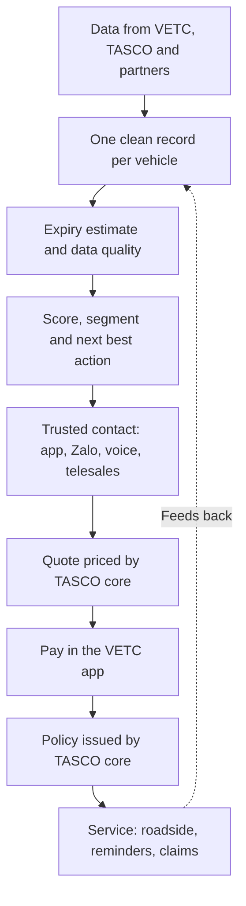
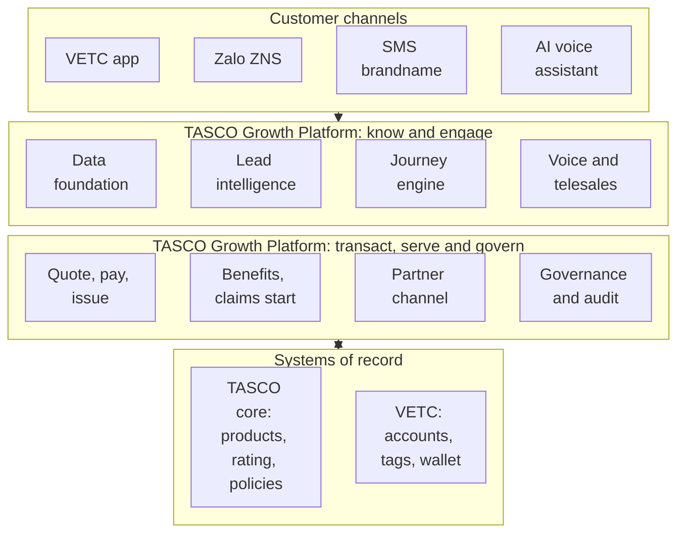

# Proposal for the TASCO Motor Insurance Growth Platform

| | |
|---|---|
| Prepared for | TASCO Insurance |
| Prepared by | iorta TechNXT |
| Reference | ITN-TASCO-2026-001 |
| Version | 1.0, issued 8 October 2026 |
| Validity | 90 days from the date of issue |
| Classification | Commercial in confidence |

## 1. Executive summary

Every month, around six million drivers pass through VETC toll gantries, and most of them open the VETC app to do it. Every one of those drivers is required by law to carry compulsory motor third-party liability insurance. Very few other companies in Vietnam have a relationship with drivers that is this direct or this frequent. Yet this year TASCO Insurance has closed almost no motor renewals through its own channels. The policies are still being sold, but by agents, banks and showrooms, and often only when the driver is standing in an inspection queue.

We spent time with the brief and with the data behind it, and we do not believe the problem is demand. TNDS cover is compulsory, so the need is guaranteed. The problem is that TASCO does not know *when* most drivers need to renew, because only about one record in ten carries a reliable expiry date. Drivers do not trust insurance sales calls. The one lever customers ask for, a discount, is one TASCO is not allowed to pull. And the VETC app, for all its reach, cannot yet complete a purchase.

Our proposal is a growth platform that fixes these four things together. It builds a clean record for every vehicle and improves it with every interaction. It decides who to contact, when, through which channel, and with what offer. It does not ask drivers to install anything new. The same customer app runs inside the VETC app first, and later inside TASCO's own app and website and as a Zalo Mini App, and the platform reuses TASCO's core system, the VETC wallet and TASCO's contact centre rather than duplicating them. It reaches drivers in ways they trust: in the VETC app they already use, by Zalo, and by an AI voice assistant that identifies itself and asks the driver to confirm their licence plate before anything else. When a driver is ready, they renew in the VETC app: in three steps where TASCO's rules allow quick renewal, otherwise through the full purchase flow. TASCO's core system prices the policy and issues the e-certificate within seconds. Because price cannot be the reason to choose TASCO, the platform makes service the reason: roadside assistance, an e-certificate that police and inspectors can verify by QR code, reminders before inspection, and a faster claims start.

The platform is designed for growth, not only for retention. Alongside renewals, it runs journeys for drivers insured elsewhere, for new vehicles at the moment their VETC tag is activated, for lapsed and uninsured drivers, and for cross-sell of personal accident and physical damage cover. It also gives TASCO's partners an API to sell through, so that the platform works with the channels that perform today instead of against them.

The platform already exists. It is running in a UAT environment that TASCO can use today. It has a staff console for thirteen roles in Vietnamese and English, a customer app in Vietnamese, 103 API endpoints and more than 265 automated tests. That changes the economics of the MVP. TASCO's budget does not need to pay for building commodity software. It pays for what matters: connecting the platform to TASCO's core system and VETC's channels, loading and repairing real data, hardening the platform for production, and running a measured pilot.

We propose a fixed-price MVP of **USD 94,800**, within TASCO's MVP budget of USD 100,000, leaving USD 5,200 as a change reserve under TASCO's control. The pilot can be live **13 weeks** after contract signature, followed by four weeks of hypercare. We recommend a pilot of 50,000 to 100,000 vehicles in one or two provinces, measured against a control group, so that the decision to scale is based on evidence rather than projections.

## 2. Our understanding of the situation

### 2.1 The parties and what each brings

TASCO Insurance owns the insurance products, their pricing and the policy record. Its core system is, and will remain, the system of record for the product catalogue, tariffs and rating, and for every policy issued. VETC owns the relationship with the driver: the app, the wallet, the toll tag and the stream of events that tell us a vehicle is active, new, or on the road. TASCO's partners (agents, banks, showrooms and corporate partners) sell most motor policies today and are paid regulated commission for doing so.

Each party holds part of what is needed. TASCO has the product and the licence to sell it. VETC has the customer's attention and a payment method that needs no card. The partners have the closing skills. What is missing is the layer in between, which turns these assets into the right conversation with the right driver at the right moment. That layer is what we propose to build with TASCO.

### 2.2 TASCO's digital channels today

TASCO already has a presence online, and the platform is designed to work with it. Three channels matter here.

| Channel | What it does today | How the platform works with it |
|---|---|---|
| e.baohiemtasco.vn | Online purchase of compulsory TNDS for cars. The customer says whether the vehicle is used for business, then gives the vehicle type, number of seats and a phone number. Physical damage cover is marked "coming soon". | Both channels price from the same TASCO core, so a driver sees the same premium wherever they buy. The VETC app asks the same vehicle questions before it quotes. Physical damage with inspection, which is in the MVP, can later be offered on the site through the same services. Where consent allows, phone numbers left on the site without a purchase could become warm leads; we will agree this in discovery. |
| Tasco360 app | TASCO's mobile app for partners and other stakeholders, covering consultation, sales and after-sales | Tasco360 can call the partner API for quotes by plate, instant issuance and commission statements, with VETC vehicle data behind each quote. Partners keep the tool they already use. We will confirm in discovery whether Tasco360 is the first partner integration in the MVP. |
| Hotline 1900 1562, info@baohiemtasco.vn, the Zalo Official Account, Facebook and Messenger | Claims, general support and insurance questions | The customer app shows the same official contacts, so the driver hears one TASCO voice. Outbound calls should present a registered TASCO number that customers already recognise. Claims guidance points to TASCO's published compensation guidelines. |

None of these channels can reach the 6 million drivers who already use VETC at the moment they need cover, or tell when that moment is. The platform fills that gap and leaves the existing channels in place.

### 2.3 Why own-channel sales are close to zero

We see four causes, and they reinforce each other.

The first is **data**. Without a reliable expiry date, every message is a guess. A reminder sent six months early is ignored, and one sent two weeks late arrives after a partner has already sold the renewal. With only one record in ten carrying a usable policy date, most drivers cannot be reached at the right time.

The second is **trust**. Vietnamese consumers have learned to screen out unknown callers offering insurance, and for good reason. A sales call that opens by reading out the customer's personal details feels like a scam even when it is not.

The third is **price**. TNDS premiums are set by Decree 67/2023/ND-CP, and premium discounts and inducements are not permitted. Many customers hold back, expecting a discount that will never come. A renewal strategy built on price fails before it starts.

The fourth is **channel friction**. When a driver does want to renew, the VETC app cannot complete the sale. A partner can, so the partner closes it.

None of these can be fixed on its own. Better data without a trusted channel only produces better-targeted calls that still go unanswered. A trusted channel without one-tap purchase loses the customer at the last step. This is why we propose a single platform rather than four separate tools.

### 2.4 The regulatory frame

The solution has been designed around the rules that apply to motor insurance distribution in Vietnam. Each item below needs to be confirmed by TASCO's legal team during discovery; the platform encodes TASCO's decisions as configurable rules, so the answers can be applied without changing code.

| Area | What the platform does about it |
|---|---|
| Compulsory TNDS (Decree 67/2023/ND-CP) | Shows the regulated price as returned by TASCO's core system, and never offers a premium discount |
| Law on Insurance Business 08/2022/QH15 | Pays commission only to licensed partners and within configured caps; keeps disclosure text under compliance control |
| Personal data protection (Decree 13/2023/ND-CP and the Personal Data Protection Law 91/2025/QH15, effective 1 January 2026) | Purpose-based consent, a consent centre for customers, a register of access and erasure requests with a response deadline (72 hours, to be confirmed by TASCO legal), retention rules and breach-ready audit evidence |
| Cybersecurity Law 2018 and Decree 53/2022/ND-CP | Production hosting in Vietnam; no personal data leaves the country |
| Electronic Transactions Law 20/2023/QH15 | E-certificates issued by TASCO's core system and verifiable by QR code |
| Advertising and spam rules (Decree 91/2020/ND-CP) | Contact window of 08:00 to 20:00, frequency caps, do-not-contact handling and a copy guard on every message |

## 3. Our approach in one picture

The idea behind the platform is simple: every interaction with a driver should leave TASCO knowing more than it did before, and every decision about whom to contact should be made on that knowledge.

The loop matters more than any single step. When a driver confirms their expiry date in the app, answers a question from the voice assistant, buys a policy or reports a claim, that information flows back into their record. Next year's renewal starts from verified data, with less effort and at lower cost. Over two or three cycles, the data problem that blocks TASCO today becomes one of its advantages.

## 4. Why iorta TechNXT

TASCO will receive proposals that describe what a platform could do. Ours describes what a platform already does, and TASCO can verify that before making a decision. The UAT environment is available to TASCO's evaluation team now, with credentials for every role. A telesales agent can work a lead, a compliance officer can approve a rule change, and a customer can renew and receive an e-certificate, all from end to end.

We built the platform specifically for this brief. Every one of the four challenge tracks (the voice assistant, lead scoring and enrichment, the renewal engine, and value beyond discount) is implemented, and each requirement is traced through to the code that delivers it and the test that proves it.

We have engineered it to the standard an insurer should expect. Business rules are configuration, not code: products, scoring, journeys, contact policy, message copy, benefits and commission are versioned rule sets that TASCO's business teams change through a rules studio, with simulation before release and a second person's approval before anything goes live. Every decision is written to an audit trail that cannot be altered without detection. Personal data is encrypted at field level. Privileged users sign in with two-factor authentication, and incompatible roles cannot be held by the same person.

Because so much already exists, the MVP budget goes almost entirely to TASCO-specific work. That is what allows us to commit to a fixed price inside TASCO's budget and a pilot in 13 weeks.

Finally, TASCO is not locked in. The platform uses mainstream technology (Node.js, PostgreSQL, Docker and Kubernetes), documented APIs and a complete set of 38 delivery documents. TASCO receives a perpetual licence and the source code, and can run the platform with its own team or any qualified partner in future.

iorta TechNXT focuses on insurance technology, with the strapline "Transforming Insurance with AI Innovation". We operate in more than ten countries from eight offices and serve more than eleven insurance markets, including Vietnam, Malaysia, India, the Philippines, Thailand, Cambodia, Singapore, Hong Kong, Ethiopia and the USA. Our presence in Vietnam means that discovery, user acceptance testing, go-live and hypercare can be run on site with TASCO's teams, in Vietnamese and English.

## 5. How the solution answers each challenge

| Challenge | What the platform does | How we will know it works |
|---|---|---|
| Renewals through own channels are close to zero | Renewal journey from 45 days before expiry, ending in purchase in the VETC app: quick renewal in three steps where the case allows it, the full flow otherwise | Own-channel renewal rate in the pilot cohort against the control group |
| Data is weak and fragmented | One record per plate from all sources; expiry estimated with a stated confidence; customers confirm their own expiry; every contact writes back | Share of vehicles with a usable expiry date, measured monthly |
| Customers do not trust sales calls | The assistant says it is automated, asks the driver to state their plate before anything else, never asks for codes or payment, and payment happens only in the VETC app | Call completion, opt-out and complaint rates |
| Discounts are not allowed | A copy guard blocks discount language; the offer is built on service: roadside assistance, verifiable e-certificate, reminders, faster claims, multi-year cover | Zero copy-guard breaches; uptake of benefits |
| Partners close faster | Partners get an API to quote by plate and issue in under a minute, with commission capped by rule; leads are routed to the channel most likely to close | Policies through the partner API; time to certificate |
| Growth beyond renewals | Journeys for drivers insured elsewhere, new vehicles, lapsed and uninsured drivers, and cross-sell | Share of new-business policies |
| Pricing must stay correct | Every quote is priced live by TASCO's core system; the product catalogue is synchronised from core and approved before release | Zero differences between quoted and issued premium |
| Privacy and messaging rules | Consent centre, contact window, frequency caps, a register of data requests with a response deadline, and a full audit trail | Zero contact-policy breaches; every data request answered on time |

## 6. The solution

### 6.1 Capabilities

The platform has eight capability areas. They share one data model, one rules engine and one audit trail, which is why they behave consistently.

**Data foundation.** Records from VETC, TASCO's policy book and partner files are matched by licence plate into one profile per vehicle. Where sources disagree, the platform chooses the most trusted value and keeps the alternatives. It estimates the policy expiry date from all the evidence available and states how confident it is. Data stewards work a queue of records that need attention, and every field shows where it came from.

**Lead intelligence.** Each vehicle receives a score from 0 to 100, with reasons written in plain language, and a next best action. That action might be "verify the expiry first", "send the renewal", "call", or "route to the B2B team because this is a company vehicle".

**Journey engine.** Five journeys run on timed schedules across app push, Zalo, SMS, the voice assistant and telesales. Before any message is sent, the platform checks consent, the contact window, frequency limits and the wording. Important moments in the VETC ecosystem, such as a new tag activation, a booked inspection or a wallet top-up, can start a journey at once.

**Voice assistant and telesales.** The assistant identifies itself, verifies the plate, asks about current cover and interest, writes the answers back to the record and passes warm leads to a telesales agent with a summary and suggested talking points. Agents never take payment. They send the quote to the customer's VETC app, where the customer pays.

**Quote, pay and issue.** Quotes are priced by TASCO's core system. A customer renewing the same TNDS cover, with vehicle details already confirmed, can use quick renewal: review, tick the declaration and confirm payment. Everyone else uses the full purchase flow, which is always available. The customer pays from the VETC wallet. TASCO's core system binds the quote it priced and issues the policy and e-certificate. If issuance fails after payment, the platform refunds automatically.

**Benefits and claims start.** The offer is built on service rather than price. Customers can report an accident in the app with photos and location, and the claims team receives it in a queue.

**Partner channel.** Partners quote and bind through a secure API, with commission calculated and capped by rule and a monthly statement for each partner.

**Governance and audit.** A rules studio with simulation and four-eyes approval, a consent centre, a register of customers' data requests (access and erasure) with its response deadline, role-based dashboards, and an audit trail that can be verified for tampering.

### 6.2 New business, not only renewals

The brief asked about renewals. We think the larger opportunity lies in the drivers TASCO does not yet insure. The platform therefore treats the whole VETC base as a set of segments, each with its own play.

| Segment | Who they are | What the platform does | Products |
|---|---|---|---|
| Lapsed or uninsured | No valid cover can be found | Recovery journey through the app first, then a voice call with consent | TNDS |
| New vehicle | A new VETC tag has just been activated | Welcome message and a quote at activation | TNDS, personal accident, physical damage |
| TASCO renewal | A TASCO policy is due to expire | Renewal journey from 45 days before expiry | TNDS (including multi-year), add-ons |
| Insured elsewhere | Cover is held with another insurer | Conquest journey timed to that insurer's expiry | TNDS with the service bundle |
| Existing TASCO customer | Holds TASCO cover today | Cross-sell journey | Personal accident, physical damage |
| Fleet | Company-owned vehicles | Routed to TASCO's B2B team | Fleet cover |
| Partner-led | Customer of a bank, showroom or agent | Partner sells through the API | TNDS and add-ons |

### 6.3 Value beyond discount

| Benefit | Why it matters to the driver | In the MVP |
|---|---|---|
| Instant e-certificate with QR verification | Proof of cover at inspection or a roadside check in seconds, and protection against fake certificates | Yes |
| Inspection and expiry reminders | Avoids driving uninsured by accident | Yes |
| Roadside assistance | Help on the road, especially for long-distance drivers | Yes, through TASCO's assistance provider |
| Accident reporting in the app | A faster, clearer start to a claim | Yes |
| Multi-year TNDS cover | One purchase for up to three years | Yes |
| Personal accident and physical damage add-ons | Wider protection, priced by TASCO's core system | Yes; physical damage requires an inspection |
| Loyalty points | Rewards for loyal, safe drivers | Built, but switched off until TASCO legal approves |

