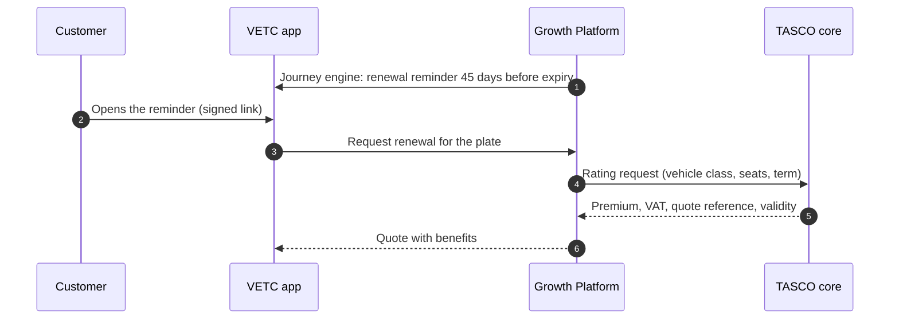
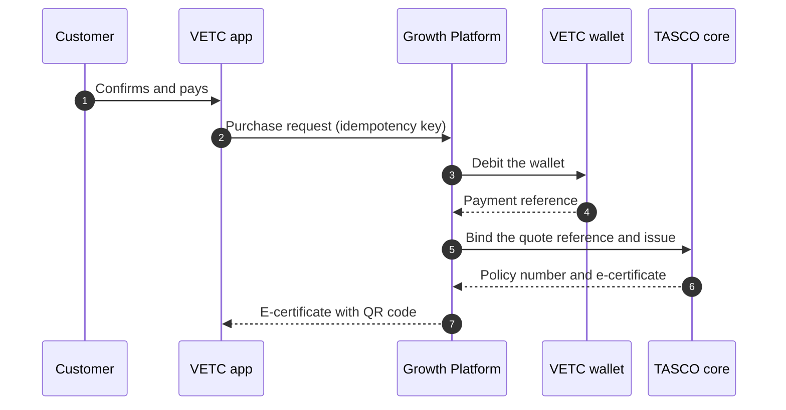
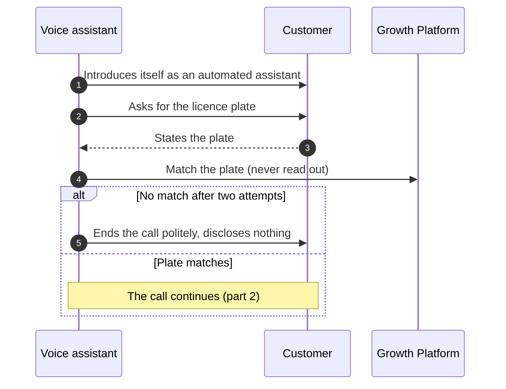
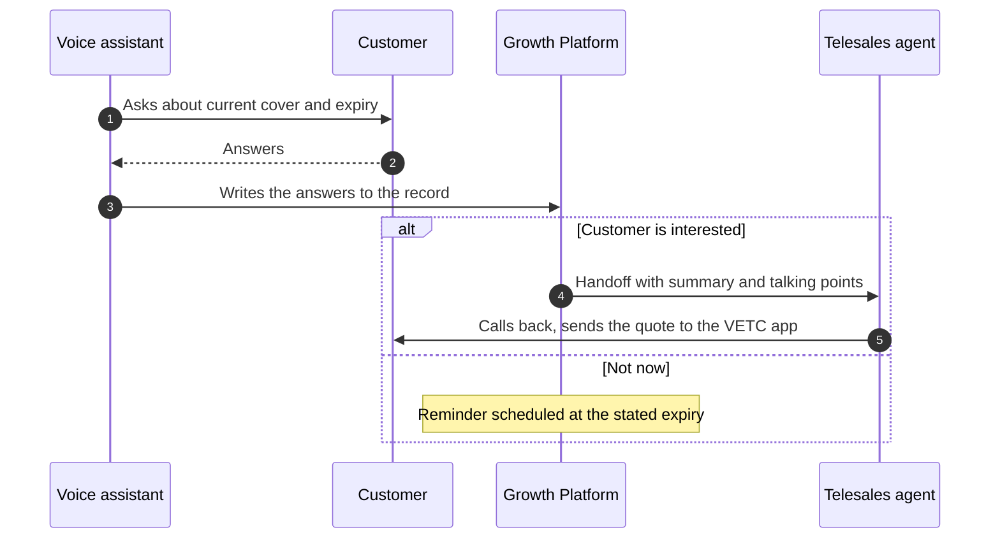
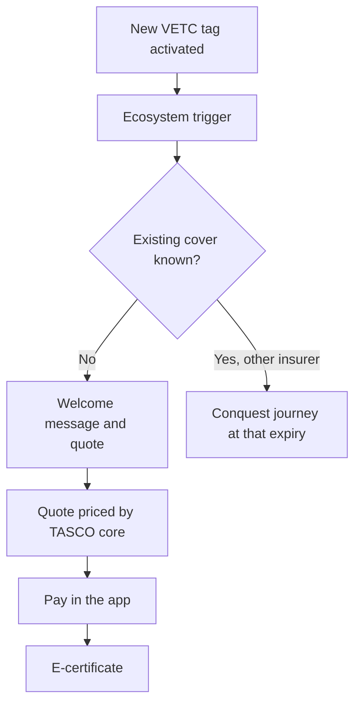
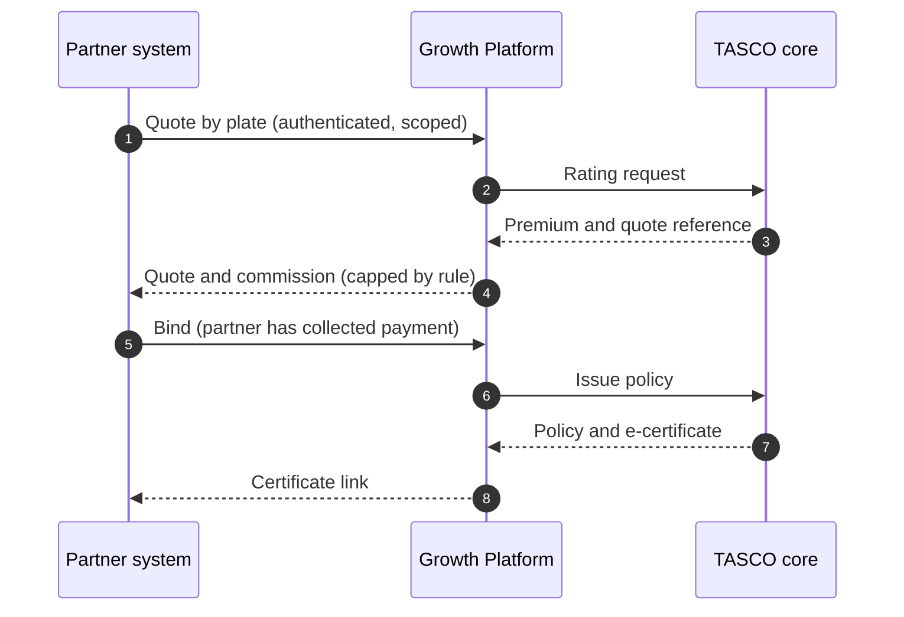
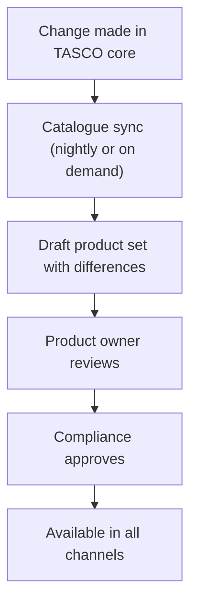

## 7. Business and process flows

### 7.1 Who does what

The responsibilities of each party stay where they belong. TASCO's core system prices and issues, VETC collects payment and hosts the customer experience, and the platform orchestrates.

| Step | Customer | VETC | TASCO core | Growth platform | Telesales or partner |
|---|---|---|---|---|---|
| Bring data together | | Accounts, vehicles, tag events | Policies and expiry dates | Matches, cleans, records lineage | Partners supply leads |
| Decide | | | | Scores, segments, chooses journey and channel | |
| Contact | Receives a message or call | Delivers app notifications | | Checks consent, timing, limits and wording | Calls warm leads |
| Quote | Reviews the quote | Hosts the purchase screen | Rates and returns a quote reference | Requests the quote, adds benefits | Sends the quote to the customer's app |
| Pay | Confirms and pays | Debits the VETC wallet | | Orchestrates, refunds if issuance fails | Never takes payment |
| Issue | Receives the e-certificate | Shows it in the app | Binds the quote and issues the policy | Stores the certificate, updates the record | |
| Serve | Uses benefits, reports claims | | Handles claims | Takes the first notice, sends reminders | |

### 7.2 Renewal in the app: quick renewal or the full flow

This is the flow that turns a reminder into a policy without a phone call. The customer app offers two paths, and the platform chooses between them for each customer each time the app opens.

| Path | Steps for the customer | When it is offered |
|---|---|---|
| Quick renewal ("Gia hạn nhanh") | 3: open the renewal, tick the declaration, then "Xác nhận thanh toán" (confirm payment) | The customer is renewing TNDS with TASCO; vehicle use and seats were confirmed by TASCO core, a matching TASCO policy or the customer within the last 365 days; no physical damage cover or add-ons; the price is not indicative; in the VETC app, the wallet balance covers the premium |
| Full flow | 6: "Gia hạn ngay", "Xem phí bảo hiểm", "Tiếp tục", declaration, "Thanh toán", "Xác nhận thanh toán" | Every other case, and always on request through "Tùy chỉnh gói bảo hiểm" (customise the cover) |

The conditions are a rule set that TASCO controls, changed through the rules studio with a second person's approval like any other rule. The declaration stays an explicit tick in both paths, so the customer confirms the vehicle details every time. Our target is a median renewal time of 60 seconds or less.

The customer then pays in the app, and TASCO core issues the policy.

Two safeguards sit behind this flow. Each purchase carries an idempotency key, so a customer who taps twice or loses signal is never charged twice. If TASCO's core system cannot issue after the wallet has been debited, the platform refunds the customer automatically and alerts the operations team.

### 7.3 Voice assistant: plate first, then handoff

When the plate matches, the assistant asks about cover and hands interested customers to telesales.

The script is governed like any other rule set: compliance approves it before it goes live. If a customer asks why they should not wait for a discount, the assistant answers truthfully: TNDS prices are set by regulation and are the same everywhere, and TASCO adds roadside assistance and an instant e-certificate.

### 7.4 New vehicle at tag activation

### 7.5 Partner sale through the API

### 7.6 Product and tariff changes

TASCO's core system remains the master for products and rating. When a product or tariff changes there, the platform picks up the change; nobody keys it in twice.

Quotes are always priced live by the core system, so a sync delay can affect which products are displayed, but never the premium a customer pays.

## 8. Personas and their journeys

### 8.1 Customers

We designed around five customer personas drawn from the VETC base.

| Persona | Situation | What they need | What the platform gives them |
|---|---|---|---|
| Anh Minh, 38, Hà Nội | Commutes daily; uses the VETC app; ignores sales calls | Renew without effort, at the right time | A reminder in the app 45 days ahead and quick renewal in three steps |
| Chú Hùng, 51, long-haul driver | Drives between Thanh Hóa, Hà Nội and Hải Phòng | Help when something goes wrong on the road | Roadside assistance as part of the offer; calls only inside the contact window |
| Chị Thảo, 32, TP. Hồ Chí Minh | Has just bought a car and activated a VETC tag | To be covered legally from the first day | A welcome offer at tag activation, with optional add-ons |
| Anh Tuấn, 45, Bình Dương | His policy lapsed months ago | To fix it without being lectured or pressured | A recovery journey that starts in the app and moves to a call only with consent |
| Chị Lan, 41, fleet manager | Runs 40 vehicles for a logistics company | One renewal date and one invoice | Routed to TASCO's B2B team; fleet portal in the scale phase |

### 8.2 Anh Minh's renewal, before and after

Today, TASCO does not know when Anh Minh's cover ends. He receives no reminder from TASCO, waits in case a discount appears, and eventually buys from whoever is in front of him at his next inspection.

With the platform, the story is different. Forty-five days before his cover ends, a notification appears in the VETC app he opens every week. It tells him the date his cover ends, the regulated price, and what TASCO includes: roadside assistance, an e-certificate he can show at any checkpoint, and a reminder before his next inspection. His vehicle details were confirmed last year and his wallet covers the premium, so the app offers quick renewal: he ticks the declaration, taps "Xác nhận thanh toán", pays from his VETC wallet, and receives his e-certificate before he has finished his coffee. Next year, his expiry date is already verified and he is offered three-year cover.

### 8.3 Anh Tuấn's return from lapsed

The platform finds no valid cover for Anh Tuấn's car. His record is good enough to act on, so the recovery journey starts with an app message. When he does not respond, and because he has consented to calls, the voice assistant calls him at 10:30 one morning. It introduces itself, asks him to state his plate, and asks whether he has cover elsewhere. He says he does not and would like to sort it out. A telesales agent receives the handoff with a two-line summary, calls him back within the hour and sends the quote to his VETC app, where he pays. The agent never asks for payment details on the phone.

### 8.4 Staff and partners

| Role | What they want from the platform | Where they work |
|---|---|---|
| Telesales agent | Fewer, better calls, with context | Handoff inbox, customer 360 view, quote and send |
| Telesales supervisor | Productivity and compliance across the team | Inbox assignment, voice assistant console |
| Campaign manager | Growth at a controlled cost | Dashboard, leads, journeys, voice campaigns |
| Product rule author | Change scoring, journeys and copy without an IT project | Rules studio |
| Compliance officer | Nothing unlawful reaches a customer; every data request answered on time | Approvals, audit trail, data-request register, governance dashboard |
| Data steward | Data the business can trust | Data-quality queue, lineage |
| Claims handler | Complete first notices, received early | Claims queue |
| Partner manager | More partner sales and clean commission | Partners, API keys, statements |
| Executive | Growth and return on investment, visible weekly | Executive dashboard |
| Support, administration and audit | A stable, secure and evidenced platform | Operations, users, audit |

## 9. User stories

The full backlog contains 79 user stories in 15 epics, with 135 acceptance scenarios written in Given/When/Then form. Most scenarios are automated functional tests; the few that need a person or a physical device are checked by hand in UAT. The table below gives one representative story per epic and shows what is in the MVP.

| Epic | Representative user story | In the MVP |
|---|---|---|
| Data foundation and repair | As a data steward, I want records from VETC, TASCO and partners merged into one profile per plate, so that each vehicle is contacted once and with the best data. | Yes |
| Lead prioritisation | As a campaign manager, I want every vehicle scored with reasons, so that effort goes to the drivers most likely to buy. | Yes |
| Renewal journeys | As a TASCO customer, I want a reminder before my cover ends, so that I am never uninsured by accident. | Yes |
| Quick renewal | As a TASCO customer renewing the same cover, I want to renew in three steps when my details are already confirmed, and still be able to change my cover, so that renewal takes about a minute. | Yes |
| New-business journeys | As a new VETC tag holder, I want to buy TNDS in the app when I activate my tag, so that I am covered from day one. | Yes |
| Voice assistant | As a customer, I want the assistant to confirm my plate before discussing my policy, so that I know the call is genuine. | Yes |
| Telesales closing | As a telesales agent, I want warm handoffs with a summary, so that I can close without cold calling. | Yes |
| Customer app | As a customer, I want to confirm and pay in the VETC app, so that I never give payment details on a call. | Yes |
| Value beyond discount | As a customer, I want roadside assistance and an instant e-certificate, so that TASCO is worth choosing at the same price. | Yes |
| Partner channel | As a showroom salesperson, I want to quote by plate and issue in under a minute, so that insurance closes with the car sale. | Yes, one partner |
| Fleet and B2B | As a fleet manager, I want one renewal date and one invoice for all my vehicles. | Routing only; portal later |
| Claims first notice | As a customer, I want to report an accident in the app with photos. | Yes |
| Privacy and consent | As a customer, I want to see and change my consents and download or erase my data; as a compliance officer, I want every request logged with its deadline so that none is answered late. | Yes |
| Rule governance | As a product rule author, I want to change scoring or wording with simulation and approval, without a software release. | Yes |
| Identity, access and audit | As an auditor, I want a tamper-evident record of every decision. | Yes |
| Operations and insight | As an executive, I want a growth dashboard by channel and segment. | Yes |

## 10. The product in use

The screens below are taken from the platform as it runs today in the UAT environment, with synthetic data.

### 10.1 The driver's experience

The customer app opens inside the VETC app from a signed link in a notification or a Zalo message, so the driver never has to sign in again or type a card number. The same app can run inside TASCO's own app and website and as a Zalo Mini App. It is written in Vietnamese and carries TASCO's look, the same as baohiemtasco.vn.

{.phone height=10.5cm} {.phone height=10.5cm} {.phone height=10.5cm}

*Left to right: the home screen offering quick renewal with the renewal countdown; the quick renewal screen, with the confirmed vehicle, the regulated premium, the VETC wallet, the declaration to tick and "Tùy chỉnh gói bảo hiểm" for the full flow; and the e-certificates issued the moment payment succeeds.*

{.phone height=10.5cm} {.phone height=10.5cm} {.phone height=10.5cm}

*Left to right: payment through TASCO's own gateway when the app runs on TASCO's website; the support sheet with the 1900 1562 hotline, the Zalo Official Account, Messenger, the Facebook page, e-mail and website; and the public verification page a police officer or inspector reaches by scanning the QR code, with no personal data shown.*

### 10.2 Telesales: fewer calls, better calls

{width=16.5cm}

*The lead queue for a Hà Nội telesales agent. Every vehicle has a score, a tier, a journey, the days to expiry, the next best action and the main reason in plain language.*

{width=16.5cm}

*The customer 360 view explains why this driver is worth a call, factor by factor, and what to offer instead of a discount.*

{width=16.5cm}

*A voice assistant call. The assistant says it is automated, the driver states the plate, a price objection is answered with service value, and the interested driver is handed to telesales.*

{width=16.5cm}

*The telesales inbox: warm handoffs with plate verification status, masked phone number, expiry, premium and suggested talking points.*

{width=16.5cm}

*The Sell tab. The agent prepares a quote with benefits and sends it to the customer's VETC app to confirm and pay. Payment is never taken on the phone.*

### 10.3 Management: growth at a glance

{width=16.5cm}

*The executive dashboard: the size of the golden record, vehicles expiring in the next 30 days, uninsured vehicles, new-business leads, policies sold, vehicles with open data issues and the voice assistant's saving compared with human calls.*

{width=16.5cm}

*Journey orchestration for the campaign manager, with consent, contact-hour and frequency checks applied to every touchpoint.*

### 10.4 Governance: change safely, prove everything

{width=16.5cm}

*The rules studio. A product owner drafts a change to scoring, compares it with the live version and simulates it on a real customer before submitting it.*

{width=16.5cm}

*Maker-checker approval. A compliance approver sees exactly what changes and approves or rejects it. The author cannot approve their own change.*

{width=16.5cm}

*The audit trail. Every material action is recorded in a hash chain that is verified by an hourly automated check, together with the voice assistant's compliance indicators.*

{width=16.5cm}

*The data-request register for the compliance officer. Each access or erasure request is logged with its channel and a 72-hour response deadline (to be confirmed by TASCO legal), shows whether it is on track, due soon or overdue, and keeps a timeline. Identity must be verified before data is exported or erased, and erasure is refused while a policy is in force.*

### 10.5 Data, claims, partners and operations

{width=16.5cm}

*The golden record with field-level lineage: where each value came from, how confident the platform is, and the competing evidence for the expiry date.*

{width=16.5cm}

*The data steward's queue of records that need attention, by issue type and source batch.*

{width=16.5cm}

*Accident reports from the app arrive in the claims queue with the plate, the policy, a description and the service-level due time.*

{width=16.5cm}

*A partner commission statement, grouped by order, with commission capped by rule.*

{width=16.5cm}

*The operations view: the state of each integration (TASCO core, VETC wallet, voice, push, Zalo ZNS and SMS), the event backlog, the active rule checksums and the job runners.*

