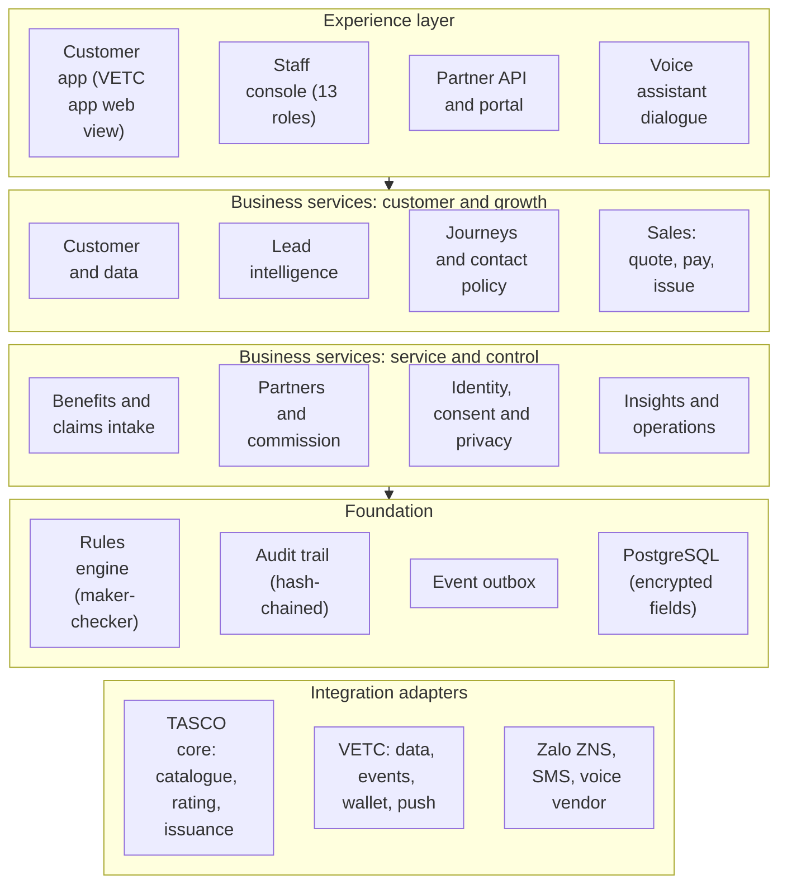
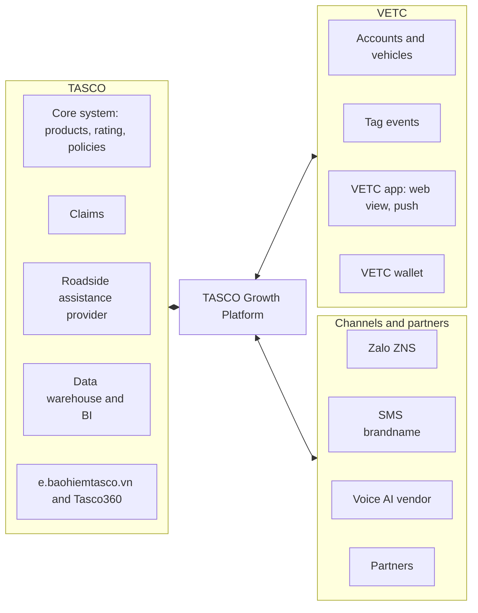
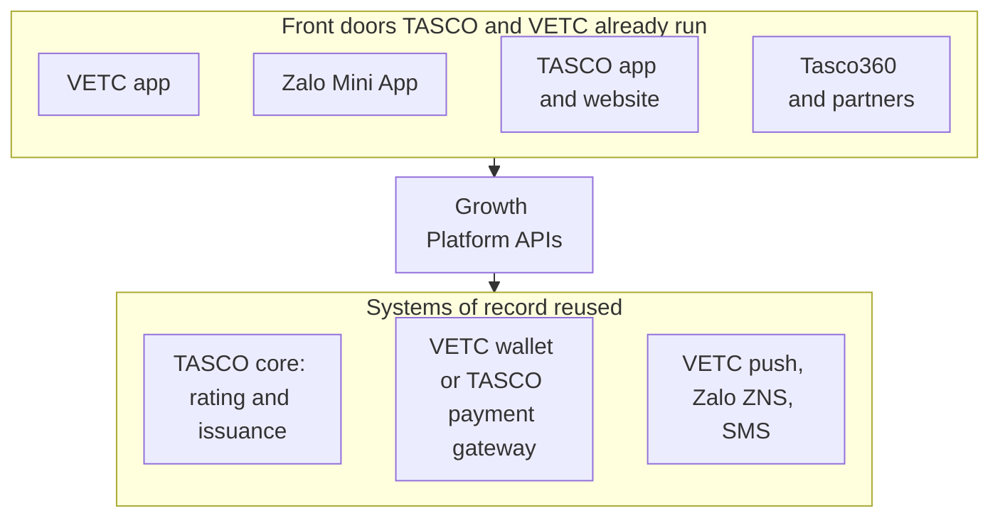
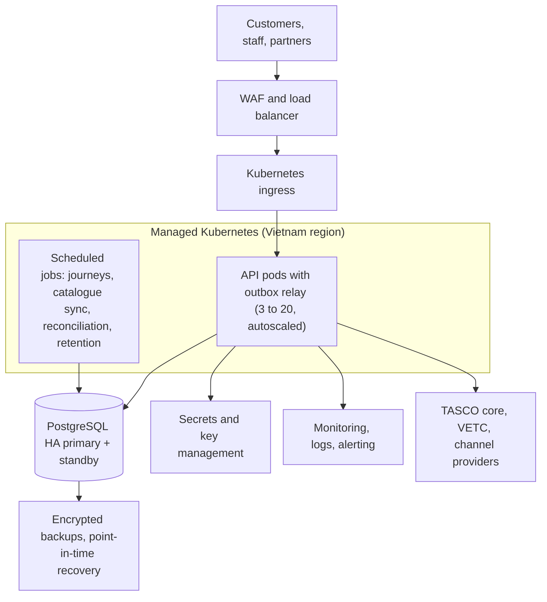

## 11. Architecture

### 11.1 Principles

We have followed a small number of principles throughout, and we will hold to them during delivery.

1. **TASCO's core system remains the system of record** for products, rating and policies. The platform never sets a premium on its own authority.
2. **Business rules are configuration.** Anything the business may want to change is a versioned rule set, changed through the rules studio with approval, not through a software release.
3. **Integrations sit behind ports.** Each external system is reached through a defined interface with its own adapter. Replacing a voice vendor or an SMS provider means writing one adapter, not reworking the platform.
4. **Every decision is explainable and audited.** Scores carry reasons, journeys record why a message was or was not sent, and the audit trail is tamper-evident.
5. **Reuse before build.** Customers do not need another app. The same customer journeys and services run inside the apps and channels TASCO and VETC already operate, and the platform builds only the layer that is missing between them.
6. **Security and privacy by design.** Least privilege, encryption, consent and data minimisation are built in, not added at the end.

### 11.2 Functional architecture

### 11.3 Technical architecture

The platform follows a hexagonal (ports and adapters) design. Business logic sits at the centre and has no knowledge of databases, HTTP or vendors. Use cases coordinate that logic. Adapters connect it to the outside world. The result is software that a different team can understand, test and extend for many years.

| Layer | What it contains | Technology |
|---|---|---|
| Presentation | Staff console, customer app, certificate verification page | HTML5 and JavaScript with no third-party runtime, strict content security policy, WCAG 2.2 AA design system; console in Vietnamese and English, customer app in Vietnamese |
| API | 80 REST endpoints described in OpenAPI 3; rate limiting, idempotency keys, input validation | Node.js 22 |
| Application | Use cases: ingestion, journeys, voice, sales, partners, claims, privacy, rules, audit | Node.js 22 |
| Domain | Pure business logic: plate and phone normalisation, enrichment, scoring, rating fallback, contact policy, dialogue | Node.js 22, no dependencies |
| Rules | JSON Logic and decision tables, versioned, simulated and approved before publication | Built in, no code evaluation |
| Persistence | Relational store with indexed columns, optimistic locking, AES-256-GCM field encryption, blind indexes for search | PostgreSQL 16 |
| Messaging | Transactional outbox and relay, so events are never lost or sent twice | PostgreSQL with `SKIP LOCKED` |
| Integration | Adapters with timeouts, retries, circuit breakers and idempotency | REST over TLS, OAuth 2.0, optional mTLS |
| Operations | Health checks, Prometheus metrics, structured logs, scheduled jobs | Kubernetes CronJobs |

## 12. Integration with TASCO's core system and VETC

### 12.1 TASCO core: the most important integration

TASCO's core system owns the product catalogue and rating, and the platform is designed to use them rather than duplicate them. The integration has five touchpoints.

| Touchpoint | Direction | Purpose | Pattern | MVP |
|---|---|---|---|---|
| Product catalogue | Core to platform | Products, versions, eligibility, add-ons and channel availability | Scheduled sync; changes become a draft that TASCO approves | Yes |
| Rating and quotation | Platform to core | Price a policy for a given vehicle and term; core returns premium, VAT, a quote reference and its validity | Real-time REST call | Yes |
| Bind and issue | Platform to core | Bind the quote core priced, after payment, and issue the policy and e-certificate | Real-time REST call, idempotent | Yes |
| Policy book | Core to platform | Active and expiring TASCO policies, to drive renewals and avoid selling to insured customers | Daily extract, then incremental | Yes |
| Cancellation and claims notification | Both | Cancel or refund where allowed; pass first notice of loss to the claims system | REST or file | First notice of loss by queue in the MVP; system-to-system in the scale phase |

Each quote records which system rated it, the core quote reference and the rating version. Rating requests carry only the risk attributes core needs (vehicle category, use, seats, age and term); the plate and the holder's name are sent to core only at issuance, together with the quote reference, so core binds exactly the price it quoted. This integration is already built into the platform: a production connector for TASCO core's REST interface, and a simulated core used in UAT, both behind the same interface. If TASCO's core system is temporarily unavailable, the platform can be configured in one of three ways, and TASCO chooses which during discovery:

- **Core only.** No quote is shown while core is unavailable; the customer is asked to try again shortly. This is the safest option.
- **Core with indicative fallback.** The platform shows an indicative price from the approved tariff tables, clearly marked as indicative. Payment is blocked until the core system has re-rated the quote.
- **Local rating.** For sandbox and testing only. Production use requires TASCO's explicit approval.

If TASCO's core system does not yet expose a rating API, there is a practical interim path. The platform rates from tariff tables synchronised from core and approved by TASCO, and core re-rates at the moment of issue, rejecting any mismatch. We will confirm the right path in the first two weeks.

### 12.2 All integration touchpoints

| System | Interface | Data exchanged | Frequency | MVP |
|---|---|---|---|---|
| VETC accounts and vehicles | Secure file transfer or API | Plate, vehicle class, seats, owner name and phone (with consent basis) | Initial load, then daily changes | Yes |
| VETC tag events | Webhook or message queue | Tag activation, inspection booking, wallet top-up | Near real time | Yes, activation |
| VETC app | Web view with signed deep links; SSO in the scale phase | Customer session, notifications | Real time | Yes |
| VETC push service | REST | Notification content and target | Per journey step | Yes |
| VETC wallet | REST | Debit, refund, status, daily reconciliation | Real time, plus daily file | Yes |
| Zalo ZNS | Zalo OA API | Approved templates only | Per journey step | Yes |
| SMS brandname | Provider API | Registered templates | Per journey step | Yes |
| Voice AI vendor | SIP and API | Calls, transcripts, outcomes | Campaign windows | Yes, one vendor |
| Partners | Partner API (scoped API keys today; OAuth 2.0 client credentials for production) | Quotes, binds, statements | Real time | Yes, one partner |
| Tasco360 partner app | Partner API | Quotes by plate, binds, statements | Real time | Candidate first partner, confirmed in discovery |
| TASCO e-commerce site (e.baohiemtasco.vn) | Shared TASCO core; optional lead feed | Same rating and products; abandoned enquiries with consent | Daily or near real time | Scale phase, to be agreed |
| TASCO data warehouse | Daily export | Leads, journeys, sales, outcomes (pseudonymised where possible) | Daily | Scale phase |

### 12.3 Reuse of existing assets

TASCO and VETC have already invested in a core system, apps, a website, a Zalo Official Account, a wallet and a contact centre. The platform is designed to reuse all of them. What we add is the data, decision and journey layer that connects them, plus one set of customer services that any of these front doors can call.

| Existing asset | Owner | What the platform reuses | How it connects | MVP |
|---|---|---|---|---|
| Core system | TASCO | Products, tariffs, rating, policy issuance, e-certificates, claims | Catalogue sync, live rating, bind and issue, daily policy extract; claims by staff queue first | Yes |
| Customer app and website (e.baohiemtasco.vn) | TASCO | Customer accounts, brand, online payment gateway | The same renewal and purchase journeys, opened as a web view or called through the customer API; payment through TASCO's own gateway; sales recorded against the TASCO channel | Supported by the platform; go-live with TASCO's release plan |
| Tasco360 | TASCO | The app partners and agents already use | Partner API: quote by plate, bind, statements | Candidate first partner |
| Zalo Official Account | TASCO | Followers, approved ZNS templates, chat | ZNS reminders and service messages; OA chat linked from the app; the same journeys as a Zalo Mini App later | ZNS yes; Mini App in the scale phase |
| Hotline 1900 1562 and contact centre | TASCO | Agents, caller identity customers recognise | Telesales inbox and handoffs; outbound calls from a registered TASCO number | Yes |
| VETC app | VETC | Reach to about 6 million drivers, push | Web view with signed links; push for reminders; single sign-on later | Yes |
| VETC wallet | VETC | Card-free payment | Debit, refund and daily reconciliation | Yes |
| VETC data and events | VETC | Vehicles, owners, tag activation | Initial file, daily changes, activation events | Yes |

Each customer session records which front door it came from. Quotes, orders and reporting carry that channel, and the payment step uses the right method for it: the VETC wallet inside the VETC app, and TASCO's own payment gateway inside TASCO's app or website. Adding a new front door is a configuration and integration task, not a new build.

### 12.4 Integration standards

All synchronous calls use TLS 1.2 or higher and OAuth 2.0, with mutual TLS available where TASCO requires it. Every call has a timeout, a bounded retry and a circuit breaker, so a slow partner system cannot slow down the platform. Calls that change state carry an idempotency key. Events are published through a transactional outbox, so they are never lost and never sent twice. Every integration has a daily reconciliation report, and differences raise an alert.

## 13. Deployment and infrastructure

### 13.1 Hosting

We propose production hosting **in Vietnam** on a managed Kubernetes and managed PostgreSQL service from a local cloud provider (for example Viettel IDC, VNG Cloud or FPT Cloud), or on TASCO's or Tasco group's existing private cloud if preferred. The choice will be confirmed in discovery against TASCO's data-residency position and existing contracts. The platform is containerised and portable, so it is not tied to any provider.

### 13.2 Environments

| Environment | Purpose | Data |
|---|---|---|
| Development | Daily engineering | Synthetic only |
| SIT and UAT | Integration testing with TASCO and VETC sandboxes; user acceptance | Synthetic or masked |
| Pre-production | Performance and security testing, release rehearsal | Masked |
| Production | Live service | Real, encrypted |

Releases move through a CI/CD pipeline that runs lint, all automated tests, coverage gates, dependency and secret scanning, container scanning, static analysis and a dynamic security scan before deployment. Database changes are versioned migrations applied automatically before each release.

### 13.3 Resilience and recovery

| Measure | Target |
|---|---|
| Availability of customer purchase path | 99.9% monthly |
| Recovery point objective | 15 minutes or less |
| Recovery time objective | 4 hours or less |
| Backups | Encrypted, point-in-time recovery for 35 days, restore tested quarterly |
| Application | At least two replicas across zones, rolling deployments, pod disruption budgets |

## 14. Security and privacy

Insurance platforms hold exactly the kind of data that attackers and regulators care about. We have built security into every layer, aligned to OWASP ASVS Level 2 and zero-trust principles.

| Area | Controls in place |
|---|---|
| Identity and access | Role-based and attribute-based access control across 13 roles; two-factor authentication for privileged users; separation of duties (for example, the author of a rule cannot approve it); account lockout; forced password change; token revocation |
| Data protection | AES-256-GCM encryption of personal fields with key rotation; blind indexes so encrypted data can still be searched; TLS everywhere; data minimisation on ingestion |
| Application security | Parameterised queries only; strict content security policy; output encoding; rate limiting; idempotency on payments; request size limits; trusted-proxy handling |
| Secrets | No secrets in code; injected from a secrets manager; separate keys per environment |
| Audit | Append-only, hash-chained audit trail protected by database triggers; daily verification |
| Privacy | Purpose-based consent; consent centre for customers; data-subject access, correction and erasure; retention rules; data lineage |
| AI governance | The voice assistant's script is versioned and approved; it discloses that it is automated; scores are explainable; humans make the final sales contact |
| Assurance | Static analysis, dependency and container scanning, secret scanning, dynamic scanning in CI; independent penetration test before go-live |

## 15. Scalability and performance

The platform is stateless at the application tier, so capacity grows by adding pods. The database is the main scaling concern, and we have designed for it: indexed columns for every query path, paging for large result sets, batch ingestion in chunks, background workers for journeys and events, and a read replica for reporting at full scale.

| Measure | Today (single instance, test environment) | Pilot target | Full-scale target |
|---|---|---|---|
| API throughput | About 337 requests per second | 50 per second sustained | 300 per second sustained |
| API response time (95th percentile) | About 103 ms | Under 300 ms | Under 300 ms |
| Vehicles under management | Synthetic test set | 100,000 | 6 million |
| Daily journey evaluations | | 100,000 | 6 million |
| Ingestion | 5,000 records per batch | Initial load within one day | Full base within one weekend; daily changes within one hour |

Full-scale capacity will be proven by load tests in pre-production during the scale phase, before the base is extended beyond the pilot.

