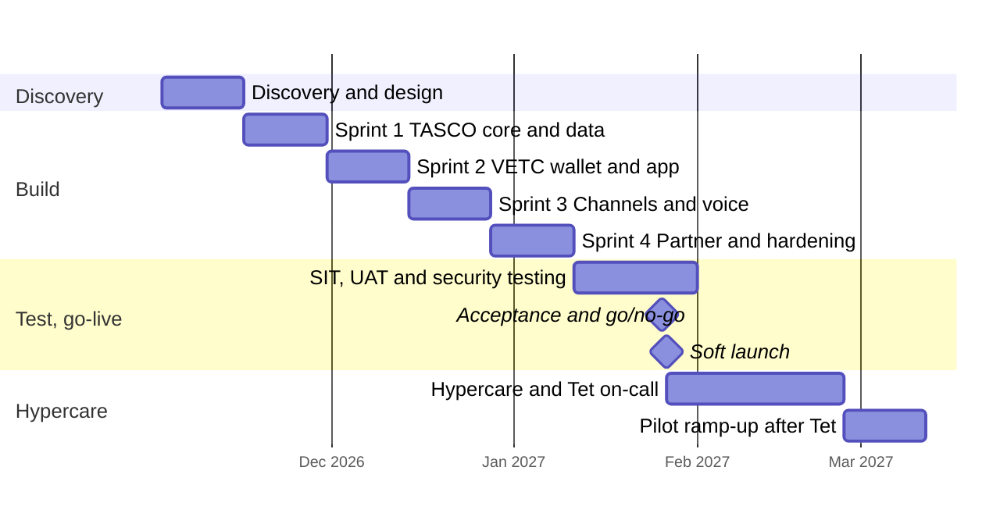

## 16. Implementation approach

### 16.1 How we will work

We will deliver in four stages, each with a clear exit. Discovery confirms the decisions that only TASCO and VETC can make: the core integration path, data sharing, legal positions and pilot design. Build and integrate runs in four two-week sprints, each ending in a demonstration on the integration sandboxes. Test and go-live covers system integration testing, user acceptance, security testing and a rehearsed cut-over. Hypercare keeps the delivery team on hand for the first four weeks of live operation.

**Reuse first.** Discovery starts with an inventory of what TASCO and VETC already run: the TASCO core interfaces, TASCO's verified Zalo Official Account and its approved ZNS templates, TASCO's payment gateway, the e.baohiemtasco.vn and Tasco360 interfaces, and VETC's web view, push and wallet. For each one we agree whether the MVP reuses it as it is, connects to it, or leaves it for later, and we record the decision in the discovery report. We build only what is missing.

Because the platform already exists, sprints are spent on adapters, data, configuration and hardening rather than on building screens. Business rules such as scoring weights, journey timings, message wording and benefits are configured with TASCO's product team in the rules studio during the sprints, not specified on paper and handed over.

### 16.2 MVP scope

| In scope for the MVP | Not in the MVP (scale phase or later) |
|---|---|
| Integration with TASCO core: catalogue sync, live rating, bind and issue, daily policy extract | Claims system-to-system integration (first notice handled by queue in the MVP) |
| VETC: initial data load and daily changes, tag-activation events, app web view with signed links, push, wallet debit and refund, reconciliation | VETC single sign-on and live feed of all VETC events (S2) |
| Zalo ZNS from TASCO's existing verified Official Account, and SMS brandname, for approved templates | Additional messaging channels |
| One voice AI vendor, Vietnamese script, plate-first verification, telesales handoff | Multiple voice vendors, outbound voice at full scale |
| Journeys: renewal, conquest, new vehicle, lapsed recovery, cross-sell | A/B testing framework, machine-learning score calibration |
| Products: TNDS (one to three years), personal accident per seat, physical damage with inspection | Further products |
| Tasco360 live on the partner API as the first partner (or another partner chosen in discovery) | Further partners and partner self-onboarding (S7) |
| Staff console (Vietnamese and English) and customer app (Vietnamese) in TASCO's brand, with TASCO's hotline, Zalo, Facebook and Messenger contacts | Fleet portal and consolidated invoicing (S6) |
| Customer journeys ready for TASCO's app and website, tested against a sandbox of TASCO's payment gateway | Live in TASCO's app and website (S3) and as a Zalo Mini App (S4) |
| Production hardening, security testing, runbooks, training, cut-over and 4 weeks of hypercare | Data warehouse feed |
| Pilot cohort of 50,000 to 100,000 vehicles with a control group | Full 6 million vehicle base |

## 17. Timeline

The plan below assumes contract signature by 30 October 2026 and work starting on 2 November 2026. Week 13 falls in late January 2027, just before Tết. Drivers travel home for the holiday, and this is when vehicles are inspected and insurance is checked at the roadside, which makes it a good moment to launch. It is also a period when staff are scarce. We therefore propose a controlled soft launch to the first part of the cohort on 27 January 2027, the day after acceptance and the go/no-go decision, a change freeze over the holiday with 24-hour on-call cover, and a ramp-up to the full pilot cohort after Tết.

| Milestone | Week | Date (indicative) | Evidence |
|---|---|---|---|
| M0 Mobilisation | 0 | 30 October 2026 | Contract signed; team onboarded |
| M1 Discovery complete | 2 | 13 November 2026 | Discovery report, integration specifications and pilot design signed off |
| M2 Integrated build | 10 | 8 January 2027 | End-to-end demonstration on sandboxes: core rating and issue, wallet debit, Zalo message, voice call |
| M3 Acceptance | 13 | 26 January 2027 | UAT signed off; no open critical or high security findings |
| M4 Pilot live and hypercare complete | 17 | 26 February 2027 | Pilot live; four weeks within service levels |

The pilot read-out, with conversion measured against the control group, is planned for early May 2027. That is long enough to cover a full renewal cycle of 45 days and to measure the conquest and new-vehicle journeys properly.

After go-live, the roadmap opens further front doors on the same journeys and connects the remaining systems. The modules (S1 to S10) are priced in section 24.3.

| Period (indicative) | Release | Content |
|---|---|---|
| 27 January to 26 February 2027 | MVP live, hypercare | Pilot in the VETC app; Zalo ZNS from TASCO's Official Account; voice assistant; Tasco360 on the partner API |
| March 2027 (optional) | S3 TASCO app and website | The same journeys in TASCO's app and website with TASCO's payment gateway |
| Early May 2027 | Pilot read-out | Conversion against the control group; decision to scale |
| May to July 2027 | Scale wave 1 | Full base in province waves (S1); VETC sign-on and live events (S2); Zalo Mini App (S4); score calibration (S9) |
| August to October 2027 | Scale wave 2 | Claims integration (S5); inspection booking and fleet portal (S6); further partners (S7); data warehouse (S8); full-scale assurance (S10) |

## 18. Strategy for adoption and roll-out

Technology alone will not move own-channel sales. The pilot is designed to answer three questions with evidence: does the platform increase policies sold, does it repair data, and do customers trust it?

**Pilot design.** We recommend one or two provinces with a mix of urban and inter-provincial drivers, for example Hà Nội and Bình Dương. Within the cohort, a randomly selected control group of around 10% receives business as usual, so that the effect of the platform can be separated from seasonality and partner activity.

**Success criteria.** We propose the following, to be confirmed in discovery.

| Measure | Pilot target |
|---|---|
| Vehicles with a usable expiry date | From about 10% to at least 35% of the cohort |
| Own-channel TNDS conversion | Significantly above the control group (statistically tested) |
| Policies bought in the app | At least 60% of own-channel sales |
| Time from confirming payment to e-certificate | Under 60 seconds for 95% of purchases |
| Renewal time in the app (quick renewal in three steps where the case allows it, the full flow in six) | Median of 60 seconds or less |
| Data requests answered within the response time | 100% |
| Complaints about contact | Fewer than 1 per 1,000 customers contacted |
| Compliance breaches (copy, consent, contact window) | Zero |
| Availability of the purchase path | 99.9% |

**Channel sequencing.** We recommend opening the front doors in order of control and measurability. The VETC app comes first, because the pilot cohort and its control group live there. Tasco360 follows as the first partner, because TASCO owns it and its users already sell TASCO policies. TASCO's own app and website can follow from March on the same journeys and TASCO's payment gateway; their sales are recorded against their own channel, so they do not blur the pilot measurement. The Zalo Mini App and further partners follow the decision to scale. TASCO's existing followers on Zalo and Facebook are the cheapest audience to tell about the new service.

**Roll-out after the pilot.** If the targets are met, the base is extended province by province, with capacity tests before each step. Partners are brought onto the API in waves, starting with those whose customers overlap least with VETC's own channels.

**Marketing and communications.** TASCO and VETC own customer communications. We will provide the message templates, the copy guard and the measurement, and we recommend launching with a simple promise: "Renew in the VETC app in one minute, with roadside help included."

## 19. Training and change management

| Audience | Format | Content | When |
|---|---|---|---|
| Telesales agents and supervisors | Classroom and practice in UAT, half a day | Handoff inbox, customer 360 view, sending quotes to the app, scripts that respect the no-discount rule | Week 12 |
| Campaign managers | Workshop, one day | Leads, journeys, voice campaigns, dashboards | Week 11 |
| Product rule authors and compliance approvers | Workshop, one day | Rules studio: drafting, simulation, approval, rollback | Weeks 9 to 11 |
| Data stewards | Workshop, half a day | Data-quality queue, corrections with evidence, lineage | Week 11 |
| Claims handlers and partner managers | Session, two hours each | Claims queue; partner onboarding, keys and statements | Week 12 |
| TASCO IT and support | Technical handover, two days | Architecture, deployment, monitoring, runbooks, incident handling | Weeks 12 to 13 |
| Tasco360 users and partner staff | Integration guide, sandbox and a short demonstration | Quote by plate, instant certificate, commission statement | From week 8 |
| TASCO digital team (TASCO app, website, Zalo OA, Tasco360) | Technical session, half a day | Embedding the journeys, partner API keys, shared wording and contacts | Week 12 |

Training is supported by the Staff Console User Manual, which has a chapter for each role, the Customer App Guide, short how-to videos recorded during UAT, and in-app help. We train a group of super users at TASCO who then support their colleagues. Change management covers clear communication of the new ways of working, especially for telesales: their role shifts from cold calling to closing warm, verified leads.

## 20. Testing and quality assurance

Quality is built into the platform. Today it has more than 265 automated tests, covering unit, integration, API, security and functional tests, with coverage above 99% of lines, and a separate PostgreSQL test suite. Every user-story scenario that can be automated has its own functional test. For the MVP we add the following.

| Test stage | What it covers | Owner | Exit criterion |
|---|---|---|---|
| Unit and component | New adapters and configuration | iorta TechNXT | Coverage gates met (at least 80%; currently above 99%) |
| Contract tests | Each TASCO core and VETC interface against its specification | iorta TechNXT with TASCO and VETC IT | All contracts pass in the sandboxes |
| System integration (SIT) | End-to-end flows across core, wallet, push, Zalo, SMS and voice | iorta TechNXT | All critical flows pass; reconciliation clean |
| Performance | Pilot volumes with headroom; ingestion of the cohort | iorta TechNXT | Targets in section 15 met |
| Security | Static and dynamic scanning, dependency and container scanning, focused manual testing of authentication, payment and partner API | iorta TechNXT; independent test recommended | No open critical or high findings |
| Accessibility | WCAG 2.2 AA checks on the customer app and console | iorta TechNXT | No blocking issues |
| User acceptance (UAT) | Business scenarios run by TASCO users | TASCO, supported by iorta TechNXT | Sign-off by the TASCO product owner |
| Operational acceptance | Backup and restore, failover, monitoring, runbooks | iorta TechNXT with TASCO IT | Restore and failover rehearsed |

A test-case workbook with conditions, scenarios, expected results and actual results is maintained throughout and handed over at acceptance.

## 21. Production support

After hypercare, we offer a managed service that keeps the platform healthy and lets TASCO's business teams keep improving it.

| Priority | Example | Response | Restoration or workaround |
|---|---|---|---|
| P1 Critical | Customers cannot buy; suspected data breach | 30 minutes, 24 hours a day, 7 days a week | 4 hours |
| P2 High | A journey run fails; one integration is down | 2 business hours | 1 business day |
| P3 Medium | A defect with a workaround | Next business day | Next scheduled release |
| P4 Low | A question or small enhancement | 3 business days | Planned |

Business hours are 08:00 to 17:30 Vietnam time, Monday to Friday, excluding public holidays. The service includes monitoring and alerting, security patching, monthly releases, support for rule changes, a quarterly restore test, a monthly service report and a quarterly business review with TASCO. Support is provided in English and Vietnamese.

## 22. Governance

| Forum | How often | Who attends | Purpose |
|---|---|---|---|
| Steering committee | Monthly | TASCO and VETC sponsors, iorta TechNXT engagement lead | Direction, budget, milestones, risks, pilot results |
| Product council | Every two weeks | TASCO product owner, VETC lead, iorta TechNXT analyst and architect | Priorities, rule changes, scope decisions |
| Sprint review | Every two weeks | Product owner and key users | Demonstration against acceptance criteria |
| Change control | As needed | Product owner and engagement lead | Assess and approve changes to scope, price or time |
| Compliance checkpoint | Each release | TASCO compliance | Customer wording, consent, privacy, audit evidence |

